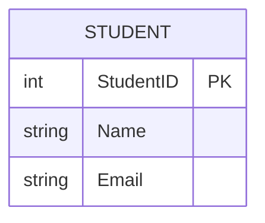
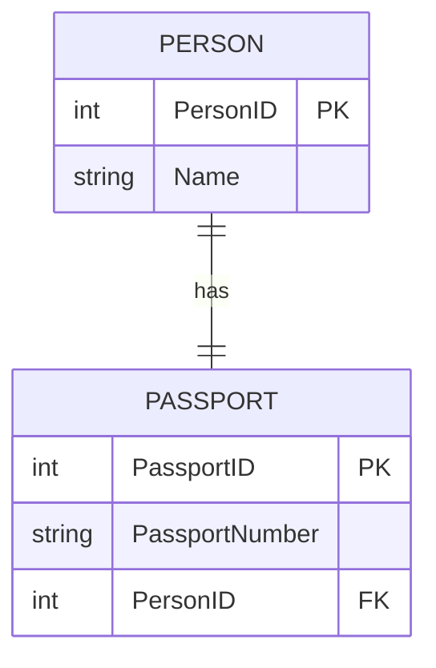
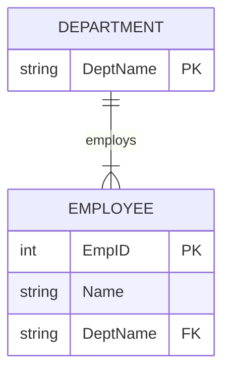
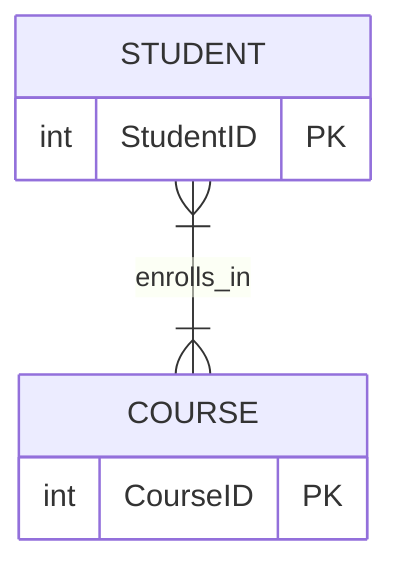
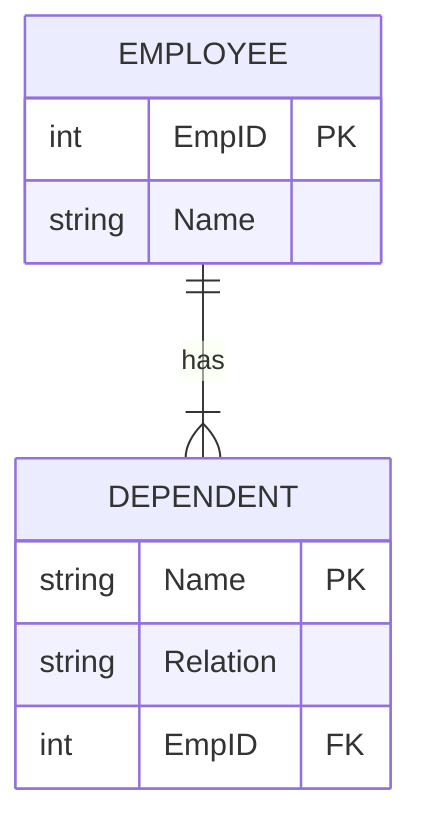

# Entity-Relationship (ER) Modeling

## ER Diagrams

An **Entity-Relationship (ER) Diagram** is a visual representation of the data and its relationships. It is used to design the conceptual structure of a database.

### Components of ER Diagram

1.  **Entity:** A real-world object (e.g., Student, Employee). Represented by a **Rectangle**.
2.  **Attribute:** Properties of an entity (e.g., Name, Age). Represented by an **Oval**.
    - **Key Attribute:** Uniquely identifies an entity (underlined).
    - **Multivalued Attribute:** Can have multiple values (double oval).
    - **Derived Attribute:** Derived from other attributes (dashed oval).
3.  **Relationship:** Association between entities. Represented by a **Diamond**.

## Keys

Keys are attributes used to uniquely identify a record in a table.

1.  **Super Key:** A set of one or more attributes that can uniquely identify a record.
2.  **Candidate Key:** A minimal Super Key. A table can have multiple candidate keys.
3.  **Primary Key (PK):** A candidate key chosen to uniquely identify records. It cannot be NULL.
4.  **Alternate Key:** Candidate keys that are not selected as the Primary Key.
5.  **Foreign Key (FK):** An attribute in one table that refers to the Primary Key of another table. It establishes a relationship between two tables.
6.  **Composite Key:** A Primary Key composed of multiple attributes.

## Relationships and Cardinality

Cardinality defines the number of entities in one set that can be associated with the number of entities in another set.

### 1. One-to-One (1:1)

One entity is related to exactly one other entity.
_Example: One Person has one Passport._

### 2. One-to-Many (1:N)

One entity is related to multiple entities.
_Example: One Department has many Employees._

### 3. Many-to-One (N:1)

Multiple entities are related to one entity. (Same as 1:N looked at from the other side).
_Example: Many Students belong to one Class._

### 4. Many-to-Many (N:M)

Multiple entities are related to multiple entities.
_Example: Students can enroll in many Courses, and Courses can have many Students._
_Note: In physical DB design, this requires a third "Junction Table"._

## Weak Entity

An entity that cannot be uniquely identified by its own attributes alone. It depends on a strong entity (owner entity) via an identifying relationship.

- Represented by a **Double Rectangle**.
- The relationship is represented by a **Double Diamond**.

_Example: A `DEPENDENT` (like a child) exists only if the `EMPLOYEE` (parent) exists._

