```mermaid
graph LR
    subgraph Students
    S1(Alice)
    S2(Bob)
    S3(Charlie)
    end
    subgraph Courses
    C1(Math)
    C2(Science)
    C3(History)
    end
    S1 === C1
    S2 === C2
    style S1 fill:#000
    style S2 fill:#000
    style C1 fill:#000
    style C2 fill:#000
    style S3 fill:#fff,stroke-dasharray: 5 5
    style C3 fill:#fff,stroke-dasharray: 5 5
```

```mermaid
graph LR
    subgraph Students
    S1(Alice)
    S2(Bob)
    S3(Charlie)
    end
    subgraph Courses
    C1(Math)
    C2(Science)
    C3(History)
    end
    S1 === C1
    S2 === C2
    S3 -.- NULL
    style S1 fill:#000
    style S2 fill:#000
    style S3 fill:#000
    style C1 fill:#000
    style C2 fill:#000
    style C3 fill:#fff,stroke-dasharray: 5 5
```

```mermaid
graph LR
    subgraph Students
    S1(Alice)
    S2(Bob)
    S3(Charlie)
    end
    subgraph Courses
    C1(Math)
    C2(Science)
    C3(History)
    end
    S1 === C1
    S2 === C2
    NULL -.- C3
    style S1 fill:#000
    style S2 fill:#000
    style C1 fill:#000
    style C2 fill:#000
    style C3 fill:#000
    style S3 fill:#fff,stroke-dasharray: 5 5
```

```mermaid
graph LR
    subgraph Students
    S1(Alice)
    S2(Bob)
    S3(Charlie)
    end
    subgraph Courses
    C1(Math)
    C2(Science)
    C3(History)
    end
    S1 === C1
    S2 === C2
    S3 -.- NULL1[NULL]
    NULL2[NULL] -.- C3
    style S1 fill:#000
    style S2 fill:#000
    style S3 fill:#000
    style C1 fill:#000
    style C2 fill:#000
    style C3 fill:#000
```

# SQL Intermediate

## Joins

Joins are used to combine rows from two or more tables based on a related column between them.

### Visualizing Data for Examples

Consider two tables: **Students** and **Courses**.

**Table: Students**
| ID | Name | CourseID |
|---|---|---|
| 1 | Alice | 101 |
| 2 | Bob | 102 |
| 3 | Charlie | NULL |

**Table: Courses**
| ID | CourseName |
|---|---|
| 101 | Math |
| 102 | Science |
| 103 | History |

---

### 1. INNER JOIN

Returns records that have matching values in **both** tables.

**Diagram:**



**Result:**
| Name | CourseName |
|---|---|
| Alice | Math |
| Bob | Science |

```sql
SELECT Students.Name, Courses.CourseName
FROM Students
INNER JOIN Courses ON Students.CourseID = Courses.ID;
```

---

### 2. LEFT JOIN (LEFT OUTER JOIN)

Returns all records from the **left** table (Students), and the matched records from the right table (Courses). If no match, the result is NULL.

**Diagram:**



**Result:**
| Name | CourseName |
|---|---|
| Alice | Math |
| Bob | Science |
| Charlie | NULL |

```sql
SELECT Students.Name, Courses.CourseName
FROM Students
LEFT JOIN Courses ON Students.CourseID = Courses.ID;
```

---

### 3. RIGHT JOIN (RIGHT OUTER JOIN)

Returns all records from the **right** table (Courses), and the matched records from the left table (Students).

**Diagram:**



**Result:**
| Name | CourseName |
|---|---|
| Alice | Math |
| Bob | Science |
| NULL | History |

```sql
SELECT Students.Name, Courses.CourseName
FROM Students
RIGHT JOIN Courses ON Students.CourseID = Courses.ID;
```

---

### 4. FULL JOIN (FULL OUTER JOIN)

Returns all records when there is a match in **either** left or right table.

**Diagram:**



**Result:**
| Name | CourseName |
|---|---|
| Alice | Math |
| Bob | Science |
| Charlie | NULL |
| NULL | History |

```sql
SELECT Students.Name, Courses.CourseName
FROM Students
FULL OUTER JOIN Courses ON Students.CourseID = Courses.ID;
```

---

### 5. CROSS JOIN

Returns the Cartesian product of the two tables (Every student paired with every course).

```sql
SELECT Students.Name, Courses.CourseName
FROM Students
CROSS JOIN Courses;
```

### 6. SELF JOIN

A regular join, but the table is joined with itself. Useful for hierarchical data (e.g., Employees and Managers).

```sql
SELECT A.Name AS Employee, B.Name AS Manager
FROM Employees A, Employees B
WHERE A.ManagerID = B.ID;
```

## Aggregation Functions

Perform a calculation on a set of values and return a single value.

- `COUNT()`: Returns the number of rows.
- `SUM()`: Returns the total sum of a numeric column.
- `AVG()`: Returns the average value.
- `MIN()`: Returns the smallest value.
- `MAX()`: Returns the largest value.

```sql
SELECT COUNT(*) FROM Students;
SELECT AVG(Age) FROM Students;
SELECT MAX(Salary) FROM Employees;
```

## GROUP BY and HAVING

- `GROUP BY`: Groups rows that have the same values into summary rows.
- `HAVING`: Used instead of `WHERE` with aggregate functions.

```sql
-- Count number of students in each department
SELECT Department, COUNT(*)
FROM Students
GROUP BY Department;

-- Show departments with more than 5 students
SELECT Department, COUNT(*)
FROM Students
GROUP BY Department
HAVING COUNT(*) > 5;
```
