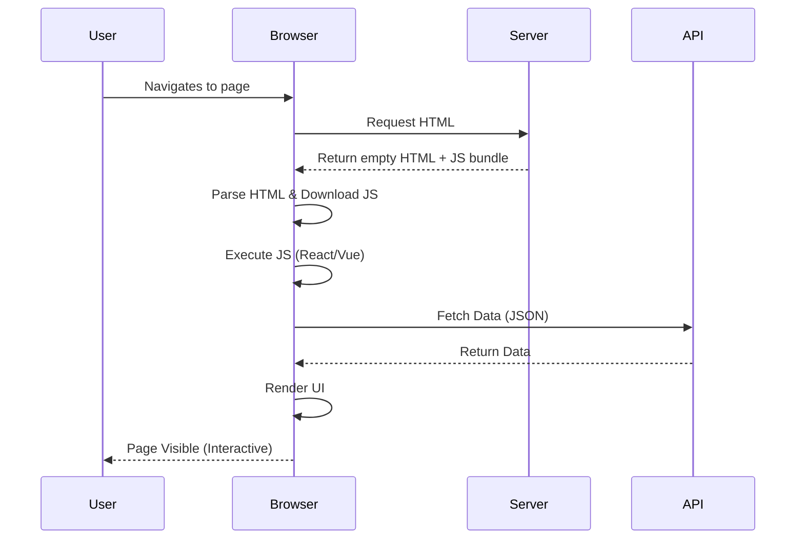
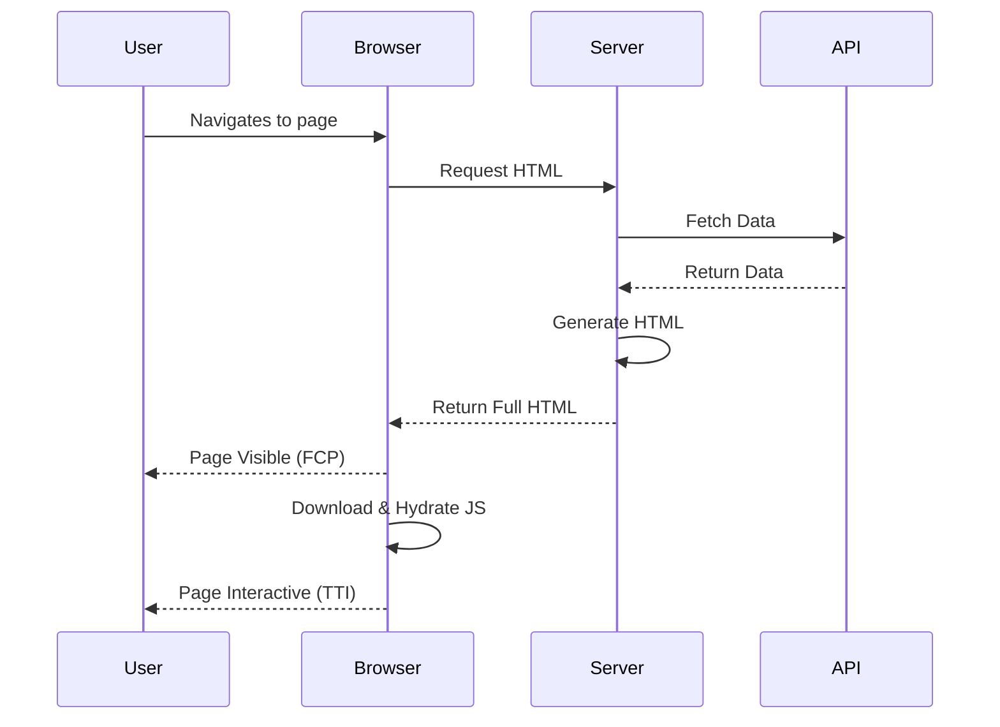
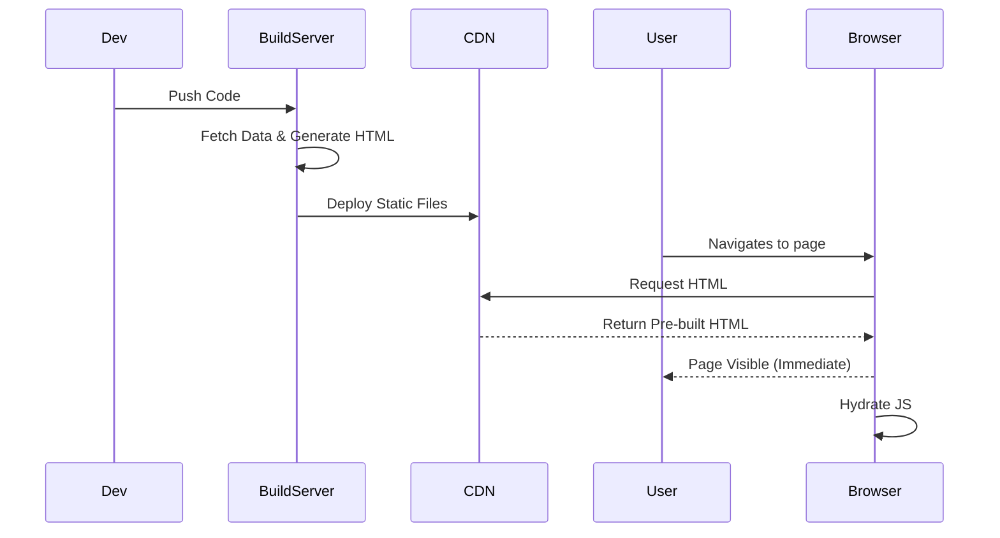

# Rendering Architecture

Choosing the right rendering strategy is critical for performance, SEO, and user experience.

## 1. Rendering Strategies Overview

| Strategy | Full Name                       | Description                                                           | Best For                                  | Pros                                   | Cons                              |
| :------- | :------------------------------ | :-------------------------------------------------------------------- | :---------------------------------------- | :------------------------------------- | :-------------------------------- |
| **CSR**  | Client-Side Rendering           | Browser downloads minimal HTML and JS. JS fetches data and builds UI. | Dashboards, SPAs, Private apps            | Fast transitions, cheap hosting        | Slow initial load (FCP), poor SEO |
| **SSR**  | Server-Side Rendering           | Server generates HTML for each request.                               | Dynamic content, Social Media, E-commerce | Great SEO, fast FCP                    | Slower TTFB, server load          |
| **SSG**  | Static Site Generation          | HTML is generated at build time.                                      | Blogs, Documentation, Marketing pages     | Fastest load, cheap hosting, great SEO | Long build times, stale data      |
| **ISR**  | Incremental Static Regeneration | SSG + background revalidation to update static pages.                 | Large e-commerce, News sites              | Fast like SSG, dynamic like SSR        | Complexity, eventual consistency  |

---

## 2. Deep Dive & Diagrams

### Client-Side Rendering (CSR)

The server sends a blank HTML shell. The browser downloads JavaScript, executes it, fetches data, and then renders the content.



**Key Metrics:**

- **Slow FCP (First Contentful Paint):** User sees a white screen or spinner initially.
- **Fast TTI (Time to Interactive):** Once loaded, interactions are snappy.

### Server-Side Rendering (SSR)

The server fetches data and generates the full HTML for _every request_.



**Key Metrics:**

- **Fast FCP:** User sees content immediately.
- **Slower TTFB (Time to First Byte):** Server must do work before sending anything.

### Static Site Generation (SSG)

HTML is generated _once_ at build time. The server (CDN) serves static files.



### Incremental Static Regeneration (ISR)

Allows you to update static pages after you’ve built your site.

1.  **Serve Stale:** Serve the existing static page (fast).
2.  **Revalidate:** Trigger a background regeneration.
3.  **Update:** Future requests get the new page.

---

## 3. Code Examples (Next.js Concepts)

### SSR Example (`getServerSideProps`)

```javascript
// Runs on every request
export async function getServerSideProps(context) {
  const res = await fetch(`https://api.example.com/data`);
  const data = await res.json();

  return { props: { data } };
}
```

### SSG Example (`getStaticProps`)

```javascript
// Runs at build time
export async function getStaticProps() {
  const res = await fetch(`https://api.example.com/posts`);
  const posts = await res.json();

  return { props: { posts } };
}
```

### ISR Example (`revalidate`)

```javascript
export async function getStaticProps() {
  const res = await fetch(`https://api.example.com/products`);
  const products = await res.json();

  return {
    props: { products },
    // Next.js will attempt to re-generate the page:
    // - When a request comes in
    // - At most once every 10 seconds
    revalidate: 10,
  };
}
```

## 4. Interview Focus

- **SEO Impact:** Search engines crawl HTML. CSR requires the crawler to execute JS (Google does this well, others might not). SSR/SSG provides pre-rendered HTML, which is perfect for SEO.
- **Performance:**
  - **FCP (First Contentful Paint):** SSG > ISR > SSR > CSR.
  - **TTI (Time To Interactive):** CSR can be faster after initial load, but SSR/SSG need "hydration" (attaching event listeners) before becoming interactive.
- **Hybrid Approach:** "For content-heavy pages (blogs, marketing), I use SSG/ISR for SEO and speed. For private, interactive dashboards, I use CSR to reduce server load and provide a native-app feel."
