# Data Fetching & API Integration

How you fetch data determines the perceived speed and stability of your application.

## 1. Data Loading Patterns

### A. Fetch-on-Render (Common but risky)

The component renders, _then_ `useEffect` runs to fetch data.

- **Pros:** Simple.
- **Cons:** "Network Waterfalls". Child components wait for parents to finish rendering before they can start their own fetches.

### B. Fetch-on-Navigation (Render-as-you-fetch)

Start fetching data _as soon as_ the user clicks a link, before the new page component even renders.

- **Pros:** Much faster, parallelizes code loading and data fetching.
- **Cons:** Requires a router that supports loaders (e.g., React Router 6.4+, Next.js).

### C. Prefetching

Predicting user behavior and loading data before they ask for it.

- **Example:** When a user hovers over a link, fetch the data for that page.

---

## 2. The "Waterfall" Problem

**Bad (Sequential/Waterfall):**
Component A loads -> Fetches User -> Renders Component B -> Fetches Posts.

```mermaid
gantt
    title Network Waterfall
    dateFormat s
    axisFormat %s

    section Component A
    Load JS        :a1, 0, 1s
    Fetch User     :a2, after a1, 2s

    section Component B
    Load JS        :b1, after a2, 1s
    Fetch Posts    :b2, after b1, 2s
```



**Good (Parallel):**
Router knows A and B are needed. Fetches User and Posts simultaneously.

```mermaid
gantt
    title Parallel Fetching
    dateFormat s
    axisFormat %s

    section Data
    Fetch User     :d1, 0, 2s
    Fetch Posts    :d2, 0, 2s

    section UI
    Load JS        :u1, 0, 1s
    Render         :u2, after d2, 0.5s
```



---

## 3. Error Handling & Resilience

Never assume an API call will succeed.

### Strategies

1.  **Graceful Fallbacks:** Show cached data or a "Retry" button instead of crashing.
2.  **Skeleton Loaders:** Mimic the layout of the content while loading to reduce layout shift (CLS).
3.  **Exponential Backoff:** If a request fails, retry after 1s, then 2s, then 4s...

### Code Example (React Query)

React Query handles loading, error, and caching states automatically.

```javascript
import { useQuery } from "@tanstack/react-query";

function UserProfile({ userId }) {
  const { data, error, isLoading, isError } = useQuery({
    queryKey: ["user", userId],
    queryFn: () => fetch(`/api/users/${userId}`).then((res) => res.json()),
    retry: 3, // Retry failed requests 3 times
  });

  if (isLoading) return <SkeletonProfile />;

  if (isError)
    return (
      <div className="error">
        <p>Failed to load user.</p>
        <button onClick={() => window.location.reload()}>Retry</button>
      </div>
    );

  return (
    <div>
      <h1>{data.name}</h1>
    </div>
  );
}
```

## 4. API Design for Frontend

If you control the backend, design APIs that help the frontend:

- **Pagination:** Cursor-based is better for infinite scroll; Offset-based is better for page numbers.
- **Partial Responses:** GraphQL or sparse fieldsets (`GET /users?fields=id,name`) to reduce payload size.
- **BFF (Backend for Frontend):** An intermediate server that aggregates multiple microservice calls into one response for the UI.
