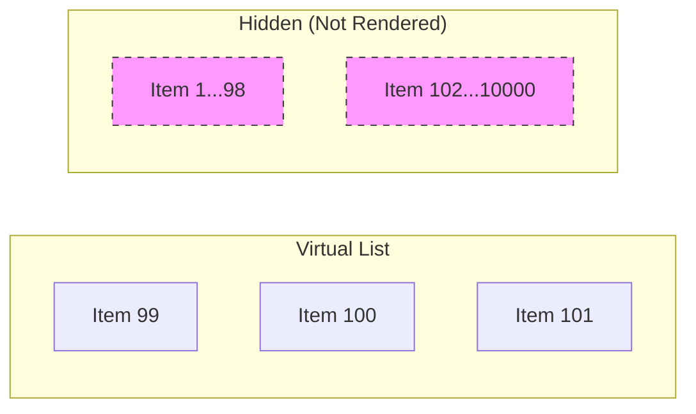

# Performance Optimization

Performance is not just about speed; it's about user retention and conversion.

## 1. JavaScript Optimization

The fastest code is the code you don't load.

### A. Code Splitting & Dynamic Imports

Instead of sending one giant `bundle.js`, split it into smaller chunks.

- **Route-based splitting:** Each page gets its own JS file.
- **Component-based splitting:** Load heavy components (like a Chart or Map) only when needed.

```javascript
import dynamic from "next/dynamic";

// This component will not be included in the initial bundle
const HeavyChart = dynamic(() => import("./components/HeavyChart"), {
  loading: () => <p>Loading Chart...</p>,
  ssr: false, // Disable SSR if the library relies on 'window'
});

function Dashboard() {
  return (
    <div>
      <h1>Dashboard</h1>
      <HeavyChart />
    </div>
  );
}
```

### B. Tree Shaking

Removing dead code. Modern bundlers (Webpack, Vite, Rollup) do this automatically if you use ES Modules (`import`/`export`).

- **Tip:** Avoid importing whole libraries.
  - ❌ `import _ from 'lodash';` (Imports everything)
  - ✅ `import debounce from 'lodash/debounce';` (Imports only debounce)

---

## 2. Rendering Performance

React is fast, but you can make it slow by re-rendering too often.

### A. Memoization (`useMemo`, `useCallback`, `React.memo`)

Prevent expensive calculations or re-renders when props haven't changed.

```javascript
// Only re-calculate 'sortedList' if 'items' changes
const sortedList = useMemo(() => {
  return items.sort((a, b) => a.value - b.value);
}, [items]);

// Prevent 'handleClick' from being recreated on every render
const handleClick = useCallback(() => {
  console.log("Clicked");
}, []);
```

### B. Virtualization (Windowing)

Rendering a list with 10,000 items will crash the browser. Virtualization only renders the items currently visible in the viewport.

- **Libraries:** `react-window`, `react-virtualized`.



### C. Layout Thrashing

Reading and writing to the DOM in a loop forces the browser to recalculate layout repeatedly.

- **Fix:** Read all values first, then write all changes. Or use `requestAnimationFrame`.

---

## 3. Core Web Vitals (Google Metrics)

| Metric  | Full Name                 | Measures                                   | Target  |
| :------ | :------------------------ | :----------------------------------------- | :------ |
| **LCP** | Largest Contentful Paint  | Loading Performance (Main content visible) | < 2.5s  |
| **INP** | Interaction to Next Paint | Responsiveness (Click to update)           | < 200ms |
| **CLS** | Cumulative Layout Shift   | Visual Stability (Stuff jumping around)    | < 0.1   |

**Interview Tip:**
"I optimize LCP by optimizing images and using SSR. I optimize CLS by setting explicit width/height on images and using skeleton loaders."
