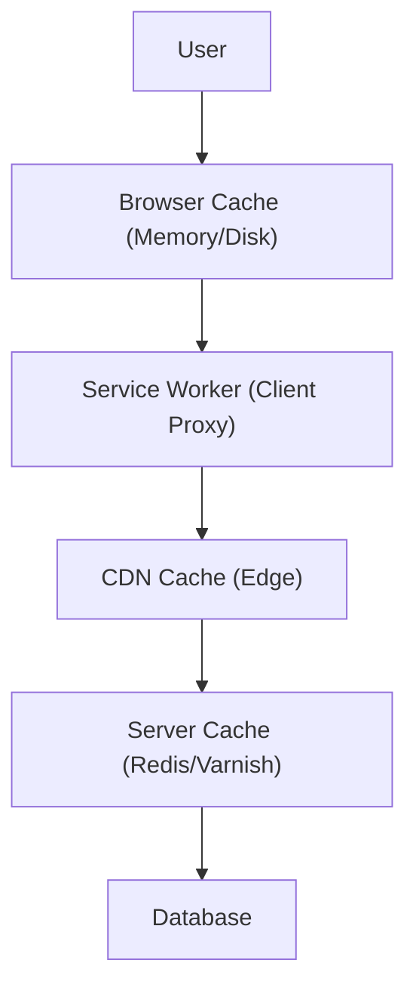

# Scalability & Caching Strategies

Scaling a frontend is different from scaling a backend. It's mostly about caching and distribution.

## 1. Frontend Scalability

### A. Stateless Frontend

The frontend server (if using SSR) should be stateless. It shouldn't store user sessions in memory.

- **Why?** So you can spin up 100 instances of the server and any request can go to any instance.
- **Solution:** Store session data in a database (Redis/SQL) or use stateless JWTs.

### B. Edge Rendering / Edge Functions

Running code closer to the user.

- Instead of a single server in Virginia, USA, you run small serverless functions in 30+ locations worldwide.
- **Use Case:** Personalizing a static page (e.g., showing "Hello, Vivek" on a cached homepage) without hitting the main origin server.

---

## 2. Caching Strategies

There are multiple layers of caching.

### A. Browser Cache (`Cache-Control`)

The most powerful cache. Controlled by HTTP headers.

- `Cache-Control: max-age=31536000, immutable`: "Don't ask the server for this file again for 1 year." (Used for hashed assets like `main.a1b2c3.js`).
- `Cache-Control: no-cache`: "Ask the server if this file has changed before using it."

### B. Cache Invalidation (Cache Busting)

How do we update the file if we cached it for 1 year?

- **File Hashing:** Change the filename. `style.css` -> `style.v2.css`. The browser treats it as a completely new file.

### C. Stale-While-Revalidate (SWR)

A strategy used in HTTP headers and libraries like React Query.

1.  **Stale:** Return the cached (old) data immediately (Fast!).
2.  **Revalidate:** Fetch new data in the background.
3.  **Update:** Replace the cache with new data for next time.

### D. Service Workers

A script that runs in the background, separate from the web page.

- **Offline Support:** Intercept network requests and serve files from a local cache even when offline.
- **PWA (Progressive Web Apps):** Enables "Install to Home Screen".
