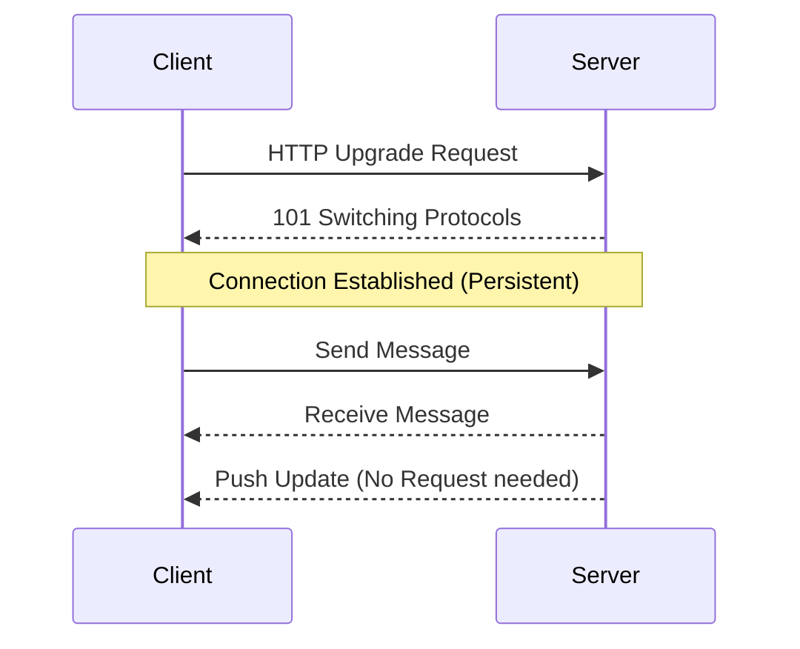

# Real-Time & Interactive Systems

For apps like Chat, Stock Tickers, or Live Sports, standard HTTP requests aren't enough.

## 1. Communication Protocols

| Protocol          | Direction        | Connection                                    | Use Case                  | Pros                      | Cons                               |
| :---------------- | :--------------- | :-------------------------------------------- | :------------------------ | :------------------------ | :--------------------------------- |
| **Short Polling** | Client -> Server | New connection every X seconds                | Simple Dashboards         | Easy to implement         | High server load, latency          |
| **Long Polling**  | Client -> Server | Connection stays open until data is available | Notifications (Legacy)    | Better than short polling | Still overhead of reconnecting     |
| **WebSockets**    | Bidirectional    | Persistent TCP connection                     | Chat, Multiplayer Games   | Real-time, low latency    | Complex to scale (stateful)        |
| **SSE**           | Server -> Client | Persistent HTTP connection                    | News Feeds, Stock Tickers | Simple, works over HTTP   | Unidirectional (Client can't send) |

---

## 2. Deep Dive

### A. Long Polling

1.  Client requests data.
2.  Server _holds_ the request open until it has new data.
3.  Server responds.
4.  Client immediately sends a new request.

### B. WebSockets (WS)

A handshake upgrades HTTP to a persistent WebSocket connection.

- **Scaling Issue:** WebSockets are stateful. If User A is connected to Server 1, and User B sends a message to Server 2, Server 2 doesn't know about User A.
- **Solution:** Use a Pub/Sub system (Redis) to broadcast messages between servers.



### C. Server-Sent Events (SSE)

Standard HTTP request where the server keeps the stream open and sends text data.

- **Format:** `Content-Type: text/event-stream`
- **Automatic Reconnection:** Built-in to the browser API (`EventSource`).

```javascript
// Client Code
const eventSource = new EventSource("/api/stream");

eventSource.onmessage = (event) => {
  console.log("New data:", JSON.parse(event.data));
};
```

---

## 3. Choosing the Right Tool

- **Chat App:** **WebSockets**. You need low latency and two-way communication (typing indicators, read receipts).
- **Live Sports Score:** **SSE**. The server just pushes updates; the user doesn't need to send anything back quickly.
- **Email Inbox:** **Short Polling** (every 30s) is usually fine. Real-time isn't critical.
