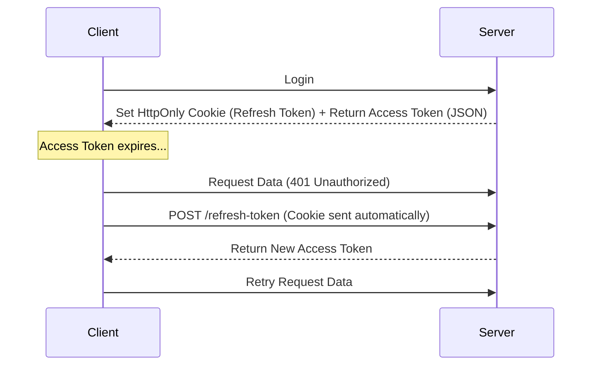

# Security in Frontend Design

Security is often overlooked in frontend interviews but is critical for seniority.

## 1. Common Vulnerabilities

### A. XSS (Cross-Site Scripting)

Attacker injects malicious scripts into your web page.

- **Reflected XSS:** Script is in the URL (e.g., `?search=`).
- **Stored XSS:** Script is saved in the DB (e.g., a comment) and shown to other users.
- **Prevention:**
  - **React:** Automatically escapes content in `{}`.
  - **Danger:** Avoid `dangerouslySetInnerHTML` unless absolutely necessary (and sanitize with `DOMPurify`).
  - **CSP (Content Security Policy):** HTTP header that tells the browser which scripts are allowed to run.

### B. CSRF (Cross-Site Request Forgery)

Attacker tricks a user into performing an action on a site they are logged into.

- **Scenario:** User visits `evil.com`, which has a hidden form that POSTs to `bank.com/transfer`. Since the user is logged in to `bank.com`, the browser sends the cookies.
- **Prevention:**
  - **SameSite Cookies:** `Set-Cookie: session_id=xyz; SameSite=Strict`. Browser won't send the cookie for cross-site requests.
  - **Anti-CSRF Tokens:** Server sends a random token; forms must include it.

### C. CORS (Cross-Origin Resource Sharing)

Browser security feature that blocks requests to a different domain unless the server explicitly allows it.

- **It's not a bug:** It protects users.
- **Header:** `Access-Control-Allow-Origin: https://myapp.com`.

---

## 2. Authentication & Token Storage

Where should you store the JWT (JSON Web Token)?

### Option A: LocalStorage

- **Pros:** Easy to use (`localStorage.setItem`).
- **Cons:** **Vulnerable to XSS.** Any script running on your page can read it.

### Option B: HttpOnly Cookie (Recommended)

- **Pros:** **Immune to XSS.** JavaScript cannot read the cookie.
- **Cons:** Vulnerable to CSRF (but preventable with SameSite/Tokens).

### Auth Flow (Refresh Tokens)

Access tokens should be short-lived (e.g., 15 mins). Refresh tokens are long-lived.

---

## 3. Security Checklist

1.  [ ] Use HTTPS everywhere.
2.  [ ] Set `HttpOnly`, `Secure`, and `SameSite` flags on cookies.
3.  [ ] Implement Content Security Policy (CSP).
4.  [ ] Sanitize user input (DOMPurify).
5.  [ ] Don't store sensitive data (passwords, keys) in LocalStorage.
