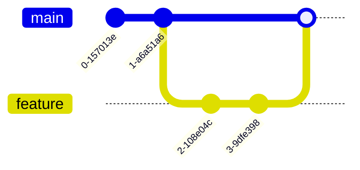
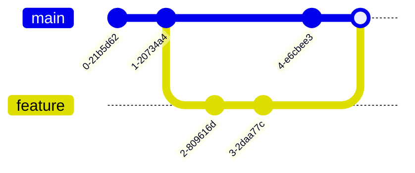

# Branching & Merging

## 1. Why Branch?

Imagine you are building a house (your code).

- **Main Branch (`main`)**: This is the actual house people live in. It must always be safe and sturdy.
- **Feature Branch**: This is a construction site next door where you build a new room.
- **Merging**: Once the room is finished and inspected, you attach it to the main house.

Branching allows you to work on new features, fix bugs, or experiment **without breaking the main code**.

## 2. Branching Commands

- **`git branch`**: Lists all local branches. The one with the `*` is your current branch.
- **`git branch <name>`**: Creates a new branch but **does not switch to it**.
- **`git checkout <name>`** or **`git switch <name>`**: Switches your working directory to the specified branch.
- **`git checkout -b <name>`**: Creates a new branch AND switches to it immediately. (Most common).
- **`git branch -d <name>`**: Deletes a branch (safe delete).
- **`git branch -D <name>`**: Force deletes a branch (even if it has unmerged changes).

## 3. Merging Strategies

Merging is the process of taking the changes from one branch and adding them to another.

### A. Fast-Forward Merge

**Scenario**: You created a branch, made commits, and meanwhile **nothing changed** on the `main` branch.
**Result**: Git simply moves the `main` pointer forward to catch up. No new "merge commit" is created. It's like just adding pages to the end of a book.



### B. Recursive (3-Way) Merge

**Scenario**: You created a branch and made commits, but **someone else also made commits** to `main` in the meantime.
**Result**: The histories have diverged. Git must combine the latest snapshots of both branches and their common ancestor to create a **new "Merge Commit"**.



### How to Merge

1.  **Switch** to the branch you want to merge _into_ (usually `main`).
    ```bash
    git checkout main
    ```
2.  **Run** the merge command.
    ```bash
    git merge feature-login
    ```
