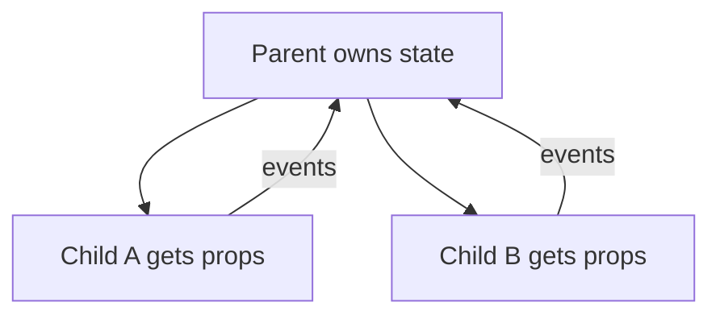

# State & Props

## What is State?

State is data **owned by a component** that can change over time and causes re-render.

```jsx
function Counter() {
  const [count, setCount] = React.useState(0);
  return <button onClick={() => setCount((c) => c + 1)}>{count}</button>;
}
```

---

## What are Props?

Props are inputs passed from parent to child. Props are **read-only**.

```jsx
function Greeting({ name }) {
  return <h1>Hello {name}</h1>;
}

function App() {
  return <Greeting name="Vivek" />;
}
```

---

## State vs Props

| Concept    | State                 | Props                       |
| ---------- | --------------------- | --------------------------- |
| Owned by   | Component             | Parent                      |
| Mutability | Mutable via setter    | Read-only in child          |
| Purpose    | Local UI/data changes | Configure child / pass data |

---

## Why state should not be updated directly (VIMP)

If you mutate state directly, React may not detect the change, causing:

- no re-render
- stale UI
- bugs with memoization

Bad (mutates):

```jsx
const [user, setUser] = useState({ name: "A" });
user.name = "B"; // ❌ mutation
setUser(user); // might not re-render
```

Good (immutable update):

```jsx
setUser((prev) => ({ ...prev, name: "B" }));
```

**Reason:** React relies heavily on **reference changes** (new object/array) to decide what changed.

---

## Lifting state up

When two siblings need the same data, move the state to the closest common parent.



Example:

```jsx
function Parent() {
  const [value, setValue] = React.useState("");

  return (
    <>
      <Input value={value} onChange={setValue} />
      <Preview value={value} />
    </>
  );
}

function Input({ value, onChange }) {
  return <input value={value} onChange={(e) => onChange(e.target.value)} />;
}

function Preview({ value }) {
  return <p>You typed: {value}</p>;
}
```

---

## What is Prop Drilling?

Prop drilling is passing props through components that don’t need them, just to reach a deep child.

```text
App
 └─ Page (passes theme)
     └─ Layout (passes theme)
         └─ Button (uses theme)
```

Solutions:

- Context API
- State management libraries (Redux/Zustand)
- Better component composition (e.g., pass components as children)
