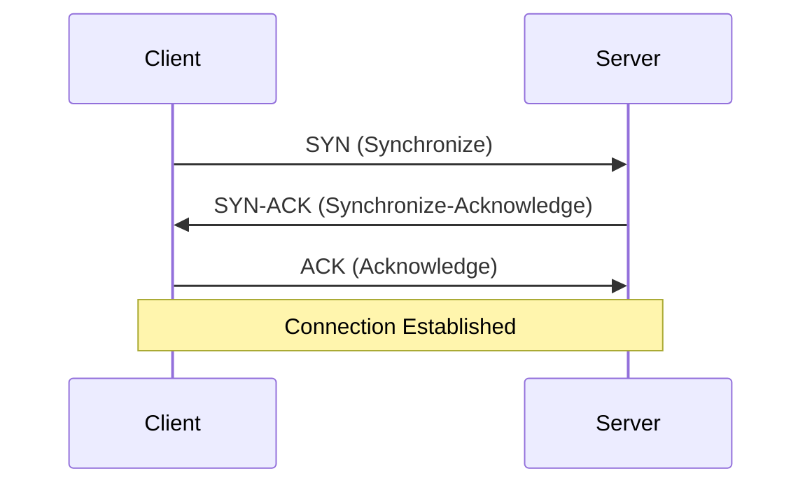

# Networking Basics

Understanding how data moves across the network is vital for debugging latency and connectivity issues.

## OSI Model (Simplified)

The Open Systems Interconnection (OSI) model describes seven layers that computer systems use to communicate over a network.

1.  **Application (Layer 7):** HTTP, FTP, SMTP, DNS. (What the user interacts with).
2.  **Transport (Layer 4):** TCP, UDP. (End-to-end connections and reliability).
3.  **Network (Layer 3):** IP. (Routing packets across networks).
4.  **Data Link (Layer 2):** Ethernet, Wi-Fi. (Node-to-node transfer).
5.  **Physical (Layer 1):** Cables, Fiber, Radio waves.

```mermaid
graph TD
    L7[Application Layer (HTTP, DNS)] --> L4[Transport Layer (TCP, UDP)]
    L4 --> L3[Network Layer (IP)]
    L3 --> L2[Data Link Layer (MAC)]
    L2 --> L1[Physical Layer (Bits)]
```

## TCP vs. UDP

### TCP (Transmission Control Protocol)

- **Connection-oriented:** Establishes a handshake (SYN, SYN-ACK, ACK) before sending data.
- **Reliable:** Guarantees delivery and order of packets. Retransmits lost packets.
- **Flow Control:** Prevents sender from overwhelming the receiver.
- **Congestion Control:** Prevents network congestion.
- **Heavyweight:** Slower due to overhead.
- **Use Case:** Web browsing (HTTP), Email (SMTP), File Transfer (FTP), Database connections.

#### TCP 3-Way Handshake



### UDP (User Datagram Protocol)

- **Connectionless:** Fire and forget. No handshake.
- **Unreliable:** No guarantee of delivery or order. No retransmission.
- **Lightweight:** Faster, lower latency.
- **Use Case:** Video streaming, Gaming, VoIP, DNS lookups.

#### Code Example: TCP vs UDP in Python

**TCP Server:**

```python
import socket

# TCP Server
server = socket.socket(socket.AF_INET, socket.SOCK_STREAM)
server.bind(('0.0.0.0', 9999))
server.listen(5)

while True:
    client, addr = server.accept()
    print(f"Connection from {addr}")
    client.send(b"Hello TCP Client!")
    client.close()
```

**UDP Server:**

```python
import socket

# UDP Server
server = socket.socket(socket.AF_INET, socket.SOCK_DGRAM)
server.bind(('0.0.0.0', 9999))

while True:
    message, addr = server.recvfrom(1024)
    print(f"Message from {addr}: {message}")
    server.sendto(b"Hello UDP Client!", addr)
```

## HTTP Versions

### HTTP/1.1

- **Text-based:** Human readable.
- **Persistent Connections:** `Keep-Alive` allows reusing TCP connections.
- **Head-of-Line Blocking:** One request per TCP connection at a time. If a request takes long, subsequent requests on that connection wait.

### HTTP/2

- **Binary Protocol:** More efficient parsing, less error-prone.
- **Multiplexing:** Multiple requests/responses over a single TCP connection simultaneously. Solves HTTP/1.1 Head-of-Line blocking.
- **Header Compression (HPACK):** Reduces overhead of repetitive headers.
- **Server Push:** Server can send resources (like CSS/JS) before client asks.

### HTTP/3 (QUIC)

- **Runs over UDP:** Replaces TCP with QUIC.
- **Solves TCP Head-of-Line Blocking:** In HTTP/2 (TCP), one lost packet delays all streams. In HTTP/3 (UDP), only the affected stream is delayed.
- **Faster Handshake:** Combines TCP handshake and TLS handshake.
- **Better for Mobile:** Handles network switching (Wi-Fi to 4G) better via Connection Migration.

| Feature                   | HTTP/1.1             | HTTP/2             | HTTP/3     |
| :------------------------ | :------------------- | :----------------- | :--------- |
| **Transport**             | TCP                  | TCP                | UDP (QUIC) |
| **Format**                | Text                 | Binary             | Binary     |
| **Multiplexing**          | No (Pipelining rare) | Yes                | Yes        |
| **Head-of-Line Blocking** | Yes                  | Yes (at TCP level) | No         |
