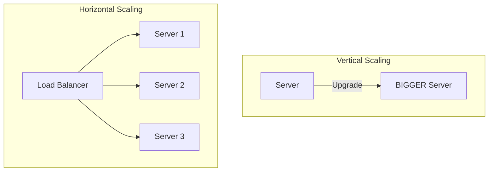

# Scalability Fundamentals

Scalability is the ability of a system to handle a growing amount of work by adding resources to the system.

## Vertical vs. Horizontal Scaling

### Vertical Scaling (Scale Up)

Adding more power (CPU, RAM, Storage) to an existing server.

- **Pros:** Simple implementation, no code changes required, easier management (1 server).
- **Cons:** Hardware limits (ceiling), single point of failure, expensive (high-end hardware costs grow exponentially).
- **Use Case:** Small to medium applications, initial database setup.

### Horizontal Scaling (Scale Out)

Adding more servers to the pool of resources.

- **Pros:** Infinite scaling (theoretically), redundancy/fault tolerance, cost-effective (commodity hardware).
- **Cons:** Complex to manage (requires load balancing, data consistency handling), network latency.
- **Use Case:** Large distributed systems (Google, Facebook).



## Stateless vs. Stateful Architectures

### Stateless

- **Definition:** Server does not retain client data (session) between requests. Each request contains all necessary info (e.g., JWT).
- **Scaling:** Easy. Any server can handle any request. Just add more servers.
- **Example:** REST APIs, CDN.

### Stateful

- **Definition:** Server remembers client data (e.g., Session ID stored in memory).
- **Scaling:** Hard. Requires "Sticky Sessions" (Load Balancer must route user to the same server) or Session Replication.
- **Example:** Real-time multiplayer games, FTP.

## Availability & Reliability

### Single Point of Failure (SPOF)

A part of a system that, if it fails, will stop the entire system from working.

- **Fix:** Redundancy (Replication, Backup servers).

### Fault Tolerance

The ability of a system to continue operating without interruption when one or more of its components fail.

- **Example:** If one DB slave dies, the master or another slave takes over reads.

### Graceful Degradation

When a system encounters a failure, it maintains limited functionality rather than crashing completely.

- **Example:** If the "Recommendations" service is down, show "Popular Items" instead of a 500 Error.

## Load Balancing

A Load Balancer (LB) distributes incoming network traffic across multiple servers to ensure no single server bears too much load.

### Algorithms

1.  **Round Robin:** Requests are distributed sequentially (A -> B -> C -> A).
2.  **Least Connections:** Sends request to the server with the fewest active connections.
3.  **IP Hash:** Hash of client IP determines the server. Ensures a user always connects to the same server (Sticky Sessions).

### Types of Load Balancers

- **L4 (Transport Layer):** Routes based on IP and Port (TCP/UDP). Faster, less context.
- **L7 (Application Layer):** Routes based on URL, Headers, Cookies. Smarter, can do SSL termination.

#### Code Example: Simple Round Robin (Python)

```python
class LoadBalancer:
    def __init__(self, servers):
        self.servers = servers
        self.index = 0

    def get_server(self):
        server = self.servers[self.index]
        # Move to next server, loop back to 0 if at end
        self.index = (self.index + 1) % len(self.servers)
        return server

lb = LoadBalancer(["Server1", "Server2", "Server3"])
print(lb.get_server()) # Server1
print(lb.get_server()) # Server2
print(lb.get_server()) # Server3
print(lb.get_server()) # Server1
```

## Key Metrics

### Latency vs. Throughput

- **Latency:** The time it takes to perform a single action (e.g., "It takes 200ms to load the page").
- **Throughput:** The number of actions the system can handle per unit of time (e.g., "The system handles 10,000 requests per second").
- **Goal:** Generally, you want high throughput and acceptable latency.

### Tail Latency (p95, p99)

Average latency hides problems. If 1% of requests take 10 seconds, that's bad for 1% of users.

- **p99:** The latency that 99% of requests fall under.
- **Example:** If p99 is 500ms, it means 99% of requests are faster than 500ms, and 1% are slower. **Optimize for p99, not average.**

### Availability vs. Reliability

- **Availability:** The percentage of time the system is operational (e.g., 99.99% uptime).
  - _Formula:_ `Uptime / (Uptime + Downtime)`
- **Reliability:** The probability that the system will produce correct outputs up to a given time (i.e., not failing or corrupting data).

### SLA, SLO, SLI

- **SLI (Indicator):** The metric you measure (e.g., latency).
- **SLO (Objective):** The goal you set (e.g., latency < 200ms).
- **SLA (Agreement):** The contract with the user (e.g., if latency > 200ms, we refund you).
