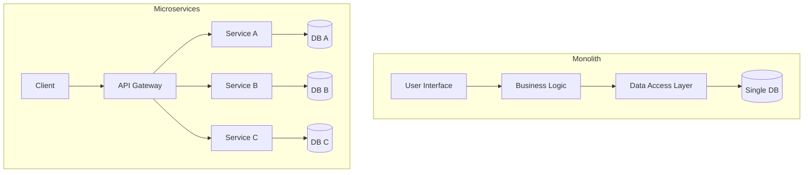
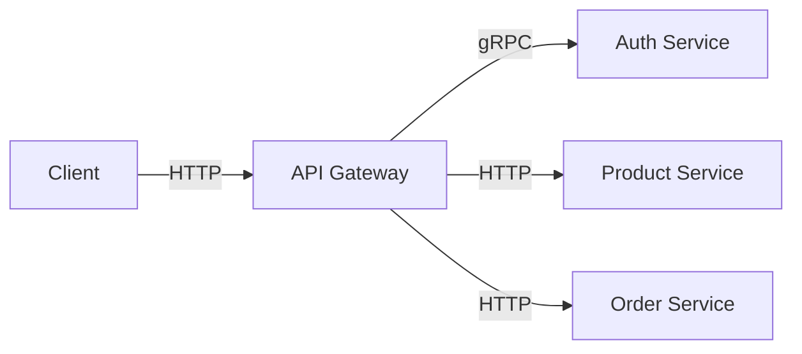

# Microservices Architecture

Microservices architecture structures an application as a collection of loosely coupled services.

## Monolith vs. Microservices

### Monolithic Architecture

- Single codebase, single build, single deployment.
- **Pros:** Simple to develop/test initially, easy deployment, no network latency between calls.
- **Cons:** Hard to scale specific parts, tight coupling (one bug can crash everything), technology lock-in, slow CI/CD pipelines.

### Microservices Architecture

- Small, independent services communicating over network (HTTP/gRPC).
- **Pros:**
  - **Independent Scaling:** Scale only the "Payment" service during Black Friday.
  - **Technology Diversity:** Use Python for AI, Go for high concurrency, Node.js for IO.
  - **Fault Isolation:** If one service fails, others continue.
- **Cons:**
  - **Complexity:** Distributed systems are hard (latency, partial failures).
  - **Data Consistency:** No cross-service transactions (need Sagas/Eventual Consistency).
  - **DevOps Overhead:** Requires advanced monitoring, logging, and deployment infrastructure.



## Key Patterns

### 1. API Gateway

A single entry point for all clients. It routes requests to appropriate microservices.

- **Functions:** Authentication, Rate Limiting, SSL Termination, Request Aggregation, Protocol Translation (REST <-> gRPC).
- **Tools:** Nginx, Kong, AWS API Gateway, Zuul.



### 2. Service Discovery

How does Service A find Service B's IP address in a dynamic environment (Kubernetes)?

- **Client-Side Discovery:** Client queries a Service Registry (e.g., Eureka, Consul) to get an IP, then calls the service.
- **Server-Side Discovery:** Client calls a Load Balancer (e.g., AWS ALB, K8s Service), which queries the Registry and routes traffic.

### 3. Circuit Breaker

Prevents cascading failures. If Service B is failing, Service A stops calling it for a while (trips the breaker) and returns a default response/error immediately, giving Service B time to recover.

- **States:**
  - **Closed:** Requests flow normally.
  - **Open:** Requests are blocked immediately (fail fast).
  - **Half-Open:** Allow a few requests to test if the service is back up.

#### Code Example: Circuit Breaker (Python Pseudo-code)

```python
class CircuitBreaker:
    def __init__(self):
        self.failure_count = 0
        self.state = "CLOSED"
        self.reset_timeout = 60 # seconds

    def call_service(self, request):
        if self.state == "OPEN":
            if time.now() > self.last_failure_time + self.reset_timeout:
                self.state = "HALF-OPEN"
            else:
                return "Service Unavailable (Fast Fail)"

        try:
            response = http.get("http://service-b/api")
            self.reset() # Success! Reset counters
            return response
        except Exception:
            self.failure_count += 1
            if self.failure_count > 5:
                self.state = "OPEN"
                self.last_failure_time = time.now()
            raise
```

### 4. Saga Pattern (Distributed Transactions)

Since you can't use ACID transactions across services, use Sagas.

- **Choreography:** Services emit events. Other services listen and react.
- **Orchestration:** A central coordinator (Orchestrator) tells services what to do.
