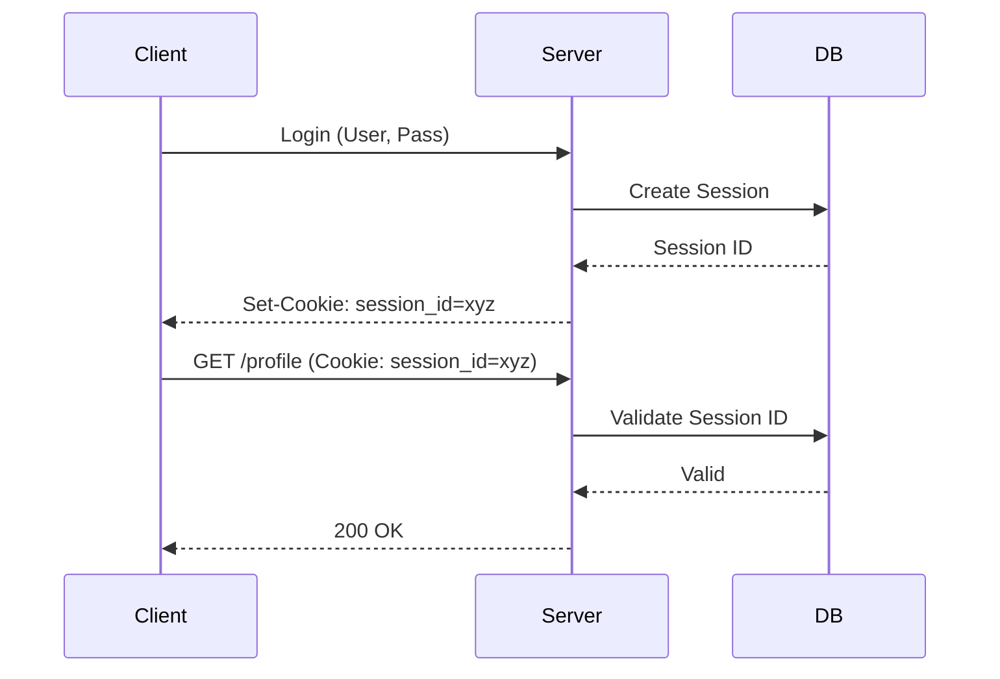
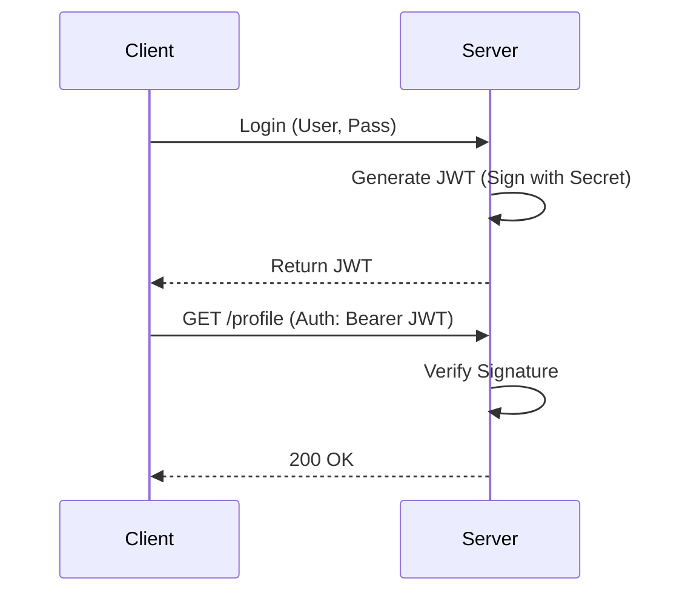

# Authentication & Authorization

Securing your API is critical. You need to know **who** the user is (Authentication) and **what** they are allowed to do (Authorization).

## Authentication (AuthN) vs. Authorization (AuthZ)

- **Authentication (AuthN):** Verifying identity. "Are you who you say you are?" (e.g., Login with Password).
- **Authorization (AuthZ):** Verifying permissions. "Can you access this resource?" (e.g., Admin vs User).

## 1. Session-Based Authentication (Stateful)

The traditional way. The server creates a session and stores it in memory/DB.

- **Flow:**
  1. User logs in.
  2. Server creates a `Session ID`, stores it in DB/Redis, and sends it to the client as a Cookie.
  3. Client sends the Cookie with every request.
  4. Server looks up the Session ID in DB to verify user.
- **Pros:** Easy to revoke (just delete from DB).
- **Cons:** **Stateful**. Hard to scale horizontally (needs Sticky Sessions or centralized Redis). CSRF vulnerable.

## 2. Token-Based Authentication (Stateless / JWT)

JSON Web Tokens (JWT) allow stateless authentication.

- **Flow:**
  1. User logs in.
  2. Server signs a JSON object (Payload) with a secret key -> JWT.
  3. Server sends JWT to client.
  4. Client stores JWT (LocalStorage/Cookie) and sends it in `Authorization: Bearer <token>` header.
  5. Server verifies the signature using the secret key. **No DB lookup needed.**
- **Pros:** **Stateless** (Scalable). Good for microservices.
- **Cons:** Hard to revoke (can't delete a token on the client). Need "Blocklist" or short expiration.

### JWT Structure

`Header.Payload.Signature`

- **Header:** Algorithm (HS256).
- **Payload:** Data (`user_id`, `role`, `exp`).
- **Signature:** `Hash(Header + Payload + Secret)`.

## 3. OAuth 2.0 (Delegated Authorization)

A standard for allowing a user to grant a third-party application access to their resources without sharing their password.

- **Roles:**

  - **Resource Owner:** The User.
  - **Client:** The App (e.g., "Login with Google").
  - **Authorization Server:** Google/Facebook Auth Server.
  - **Resource Server:** The API (Google Drive, Gmail).

- **Flow (Authorization Code Grant):**
  1. User clicks "Login with Google".
  2. Redirected to Google. User logs in and approves access.
  3. Google redirects back to App with a temporary `Code`.
  4. App exchanges `Code` for an `Access Token` (back-channel).
  5. App uses `Access Token` to fetch user data.

## Token Expiration & Refresh

Access tokens should be short-lived (e.g., 15 mins) for security.

- **Refresh Token:** A long-lived token (e.g., 7 days) used to get new Access Tokens.
- **Flow:**
  1. Access Token expires (401 Unauthorized).
  2. Client sends Refresh Token to `/refresh` endpoint.
  3. Server verifies Refresh Token (checks DB/Blocklist) and issues new Access Token.
