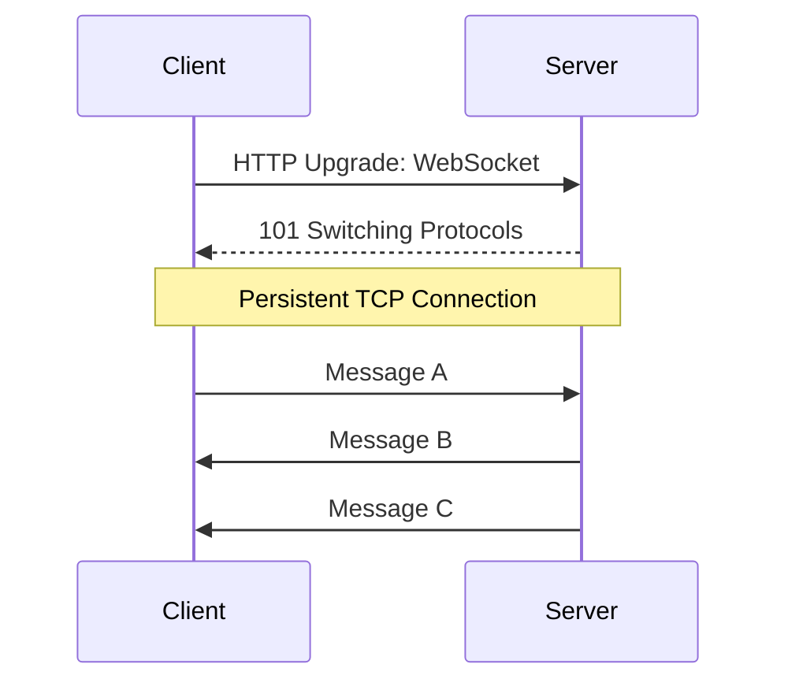

# Real-Time Systems & Communication

Standard HTTP is "Request-Response". The client asks, the server answers. But what if the server wants to push data to the client (e.g., Chat, Live Scores, Stock Tickers)?

## 1. Polling (The Old Way)

### Short Polling

The client repeatedly asks the server: "Any new data?"

- **Flow:** Request -> Response (Empty) -> Wait 1s -> Request -> Response (Data).
- **Pros:** Simple. Works everywhere.
- **Cons:** Wasteful. High latency (up to the poll interval). Server load (many empty requests).

### Long Polling

The client asks "Any new data?", and the server **holds** the connection open until data is available.

- **Flow:**
  1. Client sends Request.
  2. Server hangs (waits) until data arrives or timeout.
  3. Server responds.
  4. Client immediately sends a new Request.
- **Pros:** Better than short polling. Near real-time.
- **Cons:** Server holds many open connections. Header overhead for every message.

## 2. WebSockets (Bi-Directional)

A persistent, full-duplex communication channel over a single TCP connection.

- **Flow:**
  1. HTTP Handshake ("Upgrade: websocket").
  2. Connection upgrades to WebSocket (TCP).
  3. Data flows freely both ways (Frames).
- **Pros:** True real-time. Low overhead (no headers after handshake). Bi-directional (Server <-> Client).
- **Cons:** Stateful (Server must maintain connection). Harder to load balance (Sticky Sessions often needed). Firewalls can block non-HTTP traffic.
- **Use Cases:** Chat apps, Multiplayer games, Collaborative editing.

## 3. Server-Sent Events (SSE) (Uni-Directional)

Standard HTTP connection where the server streams data to the client.

- **Flow:** Client opens connection. Server keeps it open and pushes text-based events.
- **Pros:** Simple (Standard HTTP). Built-in reconnection. Good for "Feed" updates.
- **Cons:** Uni-directional (Server -> Client only). Text only (no binary).
- **Use Cases:** News feeds, Stock tickers, Notifications.

## Comparison

| Feature       | Short Polling  | Long Polling          | WebSockets     | SSE            |
| :------------ | :------------- | :-------------------- | :------------- | :------------- |
| **Direction** | Client Pull    | Client Pull (Hanging) | Bi-Directional | Server Push    |
| **Latency**   | High           | Medium                | Low            | Low            |
| **Overhead**  | High (Headers) | High (Headers)        | Low            | Low            |
| **Protocol**  | HTTP           | HTTP                  | TCP (via HTTP) | HTTP           |
| **Best For**  | Dashboards     | Simple Notifications  | Chat, Games    | Feeds, Tickers |
