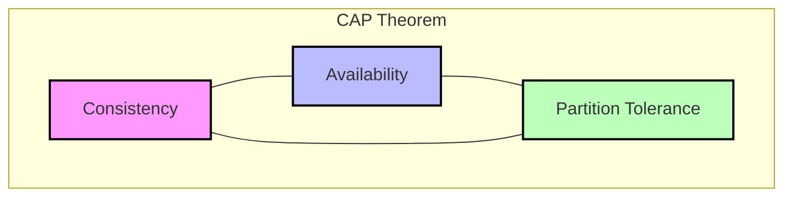
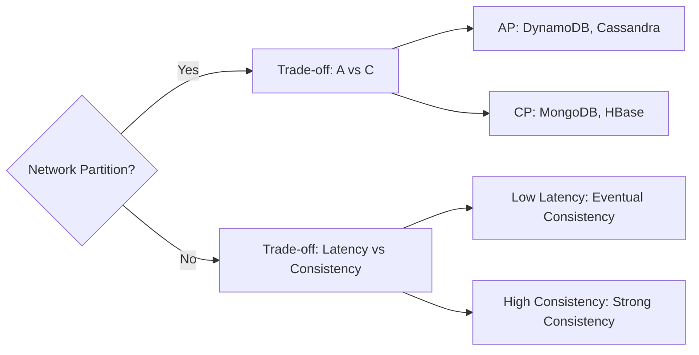

# CAP Theorem

The CAP theorem (Brewer's Theorem) states that a distributed data store can effectively provide only two of the following three guarantees: **Consistency**, **Availability**, and **Partition Tolerance**.

## The Three Pillars

### 1. Consistency (C)

Every read receives the most recent write or an error.

- **What it means:** All nodes see the same data at the same time. It's like having a single up-to-date copy of the data.
- **Example:** A banking transaction. If you transfer $100, your balance must update immediately across all servers. You cannot have one server showing $500 and another showing $400.

### 2. Availability (A)

Every request receives a (non-error) response, without the guarantee that it contains the most recent write.

- **What it means:** The system is always operational and responsive, even if some nodes are down or the data is slightly stale.
- **Example:** A social media feed. It's acceptable if a new post takes a few seconds to appear for everyone, as long as the app loads and users can interact.

### 3. Partition Tolerance (P)

The system continues to operate despite an arbitrary number of messages being dropped or delayed by the network between nodes.

- **Reality:** In a distributed system over a network (like the internet), partitions (network failures) are inevitable. **You cannot sacrifice P.**

## The Trade-off: CP vs AP

Since network partitions (P) are a fact of life in distributed systems, you must choose between Consistency (C) and Availability (A) when a partition occurs.

### CP (Consistency + Partition Tolerance)

**"I'd rather be down than wrong."**

- **Behavior:** If a partition occurs between nodes, the system shuts down non-consistent nodes or blocks writes until the partition is resolved to prevent data divergence.
- **Trade-off:** You lose Availability during a network failure.
- **Use Case:** Banking, Inventory Management, Billing Systems.
- **Technologies:** HBase, MongoDB (default configuration), Redis (default), Zookeeper.

### AP (Availability + Partition Tolerance)

**"I'd rather be wrong (temporarily) than down."**

- **Behavior:** If a partition occurs, all nodes accept writes and reads, even if they cannot communicate with each other. This leads to different versions of data on different nodes.
- **Trade-off:** You lose Strong Consistency (data might be stale). The system relies on **Eventual Consistency** to merge data once the partition is healed.
- **Use Case:** Social Media, DNS, Amazon Shopping Cart (historically).
- **Technologies:** Cassandra, DynamoDB, CouchDB, Riak.

### CA (Consistency + Availability)

**"I don't believe in networks."**

- **Behavior:** This is only possible if you assume the network never fails. In the real world of distributed systems, this doesn't exist.
- **Context:** Single-node databases (like a traditional RDBMS on one server) are effectively CA, but they are not distributed.

## Beyond CAP: The PACELC Theorem

The CAP theorem only describes what happens _during_ a partition. But what about when the system is running normally?

**PACELC** states:

- If there is a **P**artition (P), how does the system trade off **A**vailability and **C**onsistency (A vs C)?
- **E**lse (E) (when the system is running normally), how does the system trade off **L**atency (L) and **C**onsistency (C)?

### Example: DynamoDB

- **Partition:** Chooses Availability (AP).
- **Normal Operation:** You can choose between Strong Consistency (higher latency) or Eventual Consistency (lower latency).

