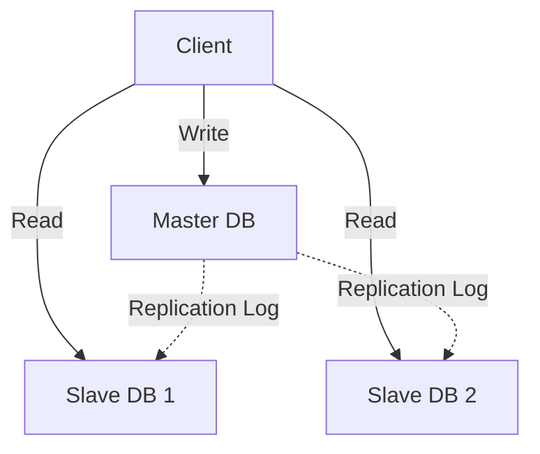
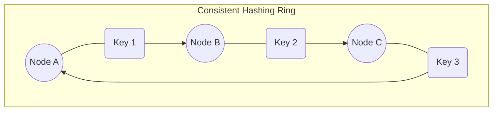

# Database Scaling

As data grows, a single database server becomes a bottleneck. Scaling can be Vertical (bigger server) or Horizontal (more servers).

## 1. Replication

Creating copies of the database to improve read performance and availability.

### Master-Slave Replication

- **Master:** Handles all **Writes** (INSERT, UPDATE, DELETE) and some Reads.
- **Slaves:** Handle only **Reads** (SELECT). They replicate data from the Master asynchronously.
- **Pros:** Improves Read performance (can add more slaves). Backup available if Master fails (promote a slave).
- **Cons:** Write bottleneck (only one Master). Replication lag (Slaves might be stale).



### Master-Master Replication

- Two or more nodes handle both Writes and Reads.
- **Pros:** High availability for writes. If one master fails, the other takes over.
- **Cons:** Complex conflict resolution (e.g., User A updates Row 1 on Master A, User B updates Row 1 on Master B).

## 2. Sharding (Horizontal Partitioning)

Splitting a large database into smaller, faster, more easily managed parts called **shards**. Each shard holds a subset of the data.

### Partitioning Criteria

#### A. Range Based

Partition by value range (e.g., User ID).

- **Shard A:** IDs 1 - 1,000,000
- **Shard B:** IDs 1,000,001 - 2,000,000
- **Issue:** Uneven distribution (Hot spots). If all active users are in Shard A, it will be overloaded.

#### B. Hash Based

Partition by a hash of the key.

- **Formula:** `shard_id = hash(user_id) % number_of_shards`
- **Pros:** Even distribution of data.
- **Issue:** **Resharding** is expensive. If you add a server, the modulo changes, and most keys need to move.

#### C. Directory Based

A lookup service knows where data lives.

- **Pros:** Flexible.
- **Cons:** Lookup service becomes a single point of failure and performance bottleneck.

### Challenges of Sharding

1.  **Joins:** Joining data across shards is expensive or impossible. You often have to denormalize data.
2.  **Transactions:** Distributed transactions (Two-Phase Commit) are slow and complex. Try to keep transactions within a single shard.
3.  **Resharding:** Moving data when a shard fills up is difficult and risky.

### Code Example: Sharding Logic

```python
def get_shard_id(user_id, total_shards):
    # Simple Hash-based sharding
    return hash(user_id) % total_shards

def get_user(user_id):
    total_shards = 4
    shard_id = get_shard_id(user_id, total_shards)

    # Connect to the specific shard database
    db_connection = connect_to_shard(shard_id)
    return db_connection.query(f"SELECT * FROM users WHERE id = {user_id}")
```

## 3. Consistent Hashing

A technique to distribute data across servers in a way that minimizes reorganization when servers are added or removed.

- **Concept:** Map both Servers and Keys to a "Ring" (0 to $2^{32}-1$).
- **Placement:** A Key is stored on the first Server found moving clockwise on the ring.
- **Adding a Node:** Only keys between the new node and its predecessor need to move.
- **Virtual Nodes:** Each physical server is mapped to multiple points on the ring to ensure even distribution.


