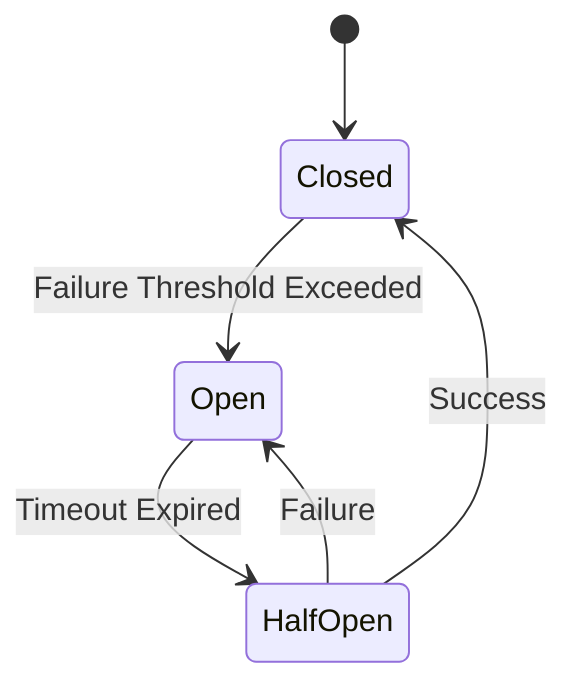

# Reliability & Fault Tolerance Patterns

Distributed systems fail. Networks glitch, services crash, and databases slow down. Reliability patterns ensure your system stays up (or fails gracefully) when parts of it go down.

## 1. Idempotency

**Definition:** An operation is idempotent if applying it multiple times has the same effect as applying it once.

- **Why it matters:** If a request times out, the client often retries. If the operation isn't idempotent (e.g., "Charge User $10"), a retry might charge them twice.
- **Implementation:** Use a unique `idempotency_key` (UUID) for every mutating request. The server checks if it has already processed that key.

## 2. Retry Pattern

Retrying transient failures (network blips) can save a request.

- **Don't Retry:** Permanent errors (400 Bad Request, 401 Unauthorized, 404 Not Found).
- **Do Retry:** Transient errors (503 Service Unavailable, 408 Request Timeout, Network Errors).

### Exponential Backoff & Jitter

Retrying immediately can hammer a struggling server ("Thundering Herd").

- **Exponential Backoff:** Wait longer between retries (1s, 2s, 4s, 8s).
- **Jitter:** Add random noise to the wait time to prevent all clients from retrying at the exact same millisecond.

```python
import time
import random

def retry_with_backoff(func, max_retries=3):
    for i in range(max_retries):
        try:
            return func()
        except Exception:
            wait_time = (2 ** i) + random.uniform(0, 1) # Exponential + Jitter
            time.sleep(wait_time)
    raise Exception("Failed after retries")
```

## 3. Circuit Breaker Pattern

If a service is down, retrying is useless and wasteful. It can also prevent the service from recovering. A Circuit Breaker stops calls to a failing service.

### States

1.  **Closed (Normal):** Requests flow through. If failures exceed a threshold (e.g., 50% fail rate), trip to Open.
2.  **Open (Broken):** Requests fail immediately (fast fail) without calling the downstream service.
3.  **Half-Open (Recovery):** After a timeout, let a _few_ requests through to test if the service is back.
    - Success? -> Reset to **Closed**.
    - Fail? -> Go back to **Open**.



## 4. Bulkhead Pattern

Isolate failures to prevent them from crashing the whole system. Named after ship bulkheads (partitions).

- **Concept:** Partition resources (thread pools, connection pools) per service.
- **Example:** Service A calls Service B and Service C.
  - If Service B is slow/down and uses up all threads, Service C calls shouldn't be blocked.
  - Assign separate thread pools: Pool B for Service B, Pool C for Service C.

## 5. Fallback Pattern

What to do when a request fails (after retries/circuit breaker)?

- **Degrade Gracefully:** Return a default value or cached data instead of an error.
- **Example:** Netflix recommendation engine fails? Show a static list of "Popular Movies" instead of a blank screen.
