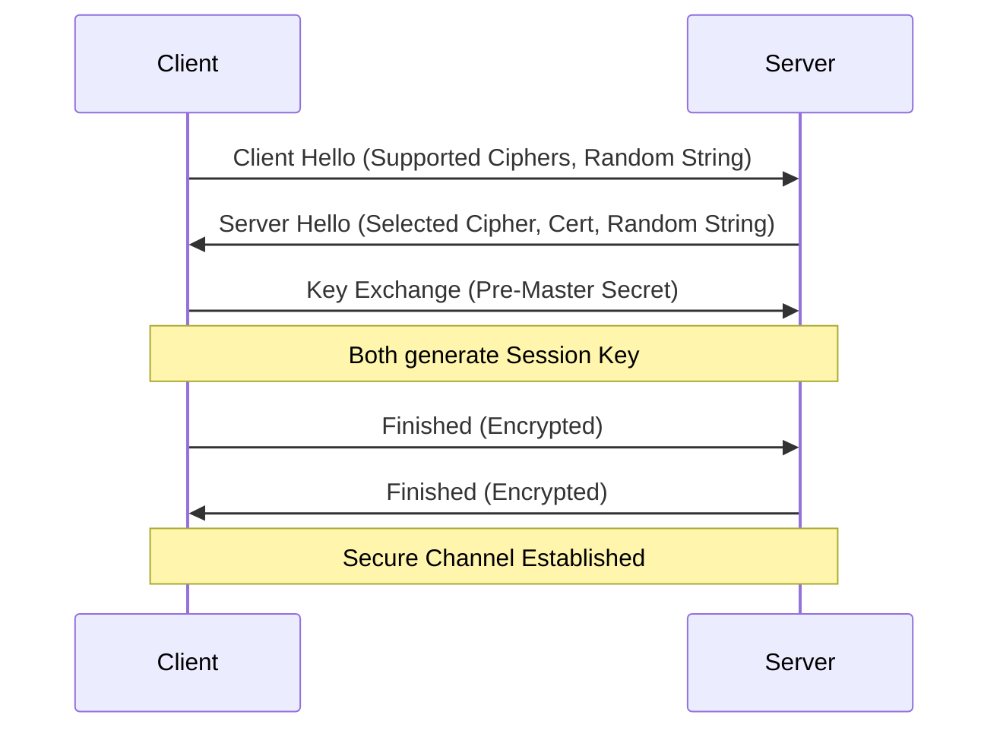

# Security in System Design

Security is a non-negotiable aspect of system design. It must be considered at every layer, from the network to the application logic.

## 1. Encryption

### Encryption in Transit (Data in Motion)

Protects data as it travels over the network.

- **HTTPS/TLS (Transport Layer Security):** The standard for secure web communication.
  - **Handshake:** Uses Asymmetric Encryption (Public/Private key) to establish a secure connection.
  - **Data Transfer:** Uses Symmetric Encryption (Shared key) for speed during the session.
- **Best Practice:** Enforce HTTPS everywhere. Use HSTS (HTTP Strict Transport Security).

#### TLS 1.3 Handshake (Simplified)



### Encryption at Rest (Data in Storage)

Protects data stored in databases, object storage (S3), or logs.

- **Database Encryption:** Transparent Data Encryption (TDE) provided by DB vendors.
- **File Encryption:** Encrypting files before uploading to S3.
- **Key Management:** Who holds the keys? Use AWS KMS, HashiCorp Vault.

## 2. Hashing vs. Encryption

- **Encryption:** Reversible. Transforms data into unreadable format but can be decrypted with a key. (e.g., Credit Card numbers).
- **Hashing:** One-way. Cannot be reversed. (e.g., Passwords).

### Hashing Algorithms

- **Fast Hashes (SHA-256, MD5):** Good for file integrity checks or checksums. **Do NOT use for passwords.**
- **Slow Hashes (bcrypt, Argon2, scrypt):** Designed to be computationally expensive to resist brute-force attacks. **Use for passwords.**
- **Salting:** Adding a random string to the password before hashing to defend against Rainbow Table attacks.

#### Code Example: Secure Password Hashing (Python)

```python
import bcrypt

# Registration
password = b"super_secret_password"
# Generate a salt and hash the password
hashed = bcrypt.hashpw(password, bcrypt.gensalt())
print(hashed) # $2b$12$LQv3c1yqBWVHxkd0LHAkCOYz6TtxMQJqhN8/LewdBPj4...

# Login
login_password = b"super_secret_password"
if bcrypt.checkpw(login_password, hashed):
    print("Login Successful")
else:
    print("Invalid Password")
```

## 3. Sensitive Data Storage

Handling PII (Personally Identifiable Information) like SSNs, emails, or health data.

- **Compliance:** GDPR (Europe), HIPAA (Health), PCI-DSS (Payments).
- **Tokenization:** Replacing sensitive data with a non-sensitive equivalent (token). The actual data is stored in a highly secure, isolated vault.
- **Masking:** Displaying only part of the data (e.g., `****-****-****-1234`).

## 4. OWASP Top 10 (Basics)

The most critical security risks to web applications.

### A. Injection (SQL Injection)

Attacker inserts malicious SQL to manipulate the DB.

**Vulnerable Code:**

```python
# BAD: Direct string concatenation
query = "SELECT * FROM users WHERE name = '" + user_input + "'"
```

_If `user_input` is `' OR '1'='1`, the query becomes `SELECT _ FROM users WHERE name = '' OR '1'='1'`, returning all users.\*

**Secure Code:**

```python
# GOOD: Parameterized Queries
cursor.execute("SELECT * FROM users WHERE name = %s", (user_input,))
```

### B. Broken Authentication

Weak session management, allowing attackers to steal identities.

- **Fix:** Use MFA, strong session IDs, short session timeouts, HttpOnly cookies.

### C. Cross-Site Scripting (XSS)

Attacker injects malicious scripts into webpages viewed by other users.

- **Reflected XSS:** Script is in the URL.
- **Stored XSS:** Script is saved in the DB (e.g., a comment).
- **Fix:** Escape all user input before rendering. Use Content Security Policy (CSP).

### D. Cross-Site Request Forgery (CSRF)

Attacker tricks a logged-in user into performing an action without their consent.

- **Fix:** Use Anti-CSRF tokens.
