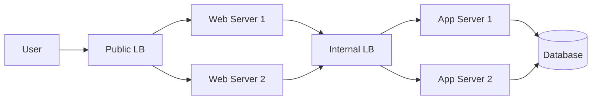
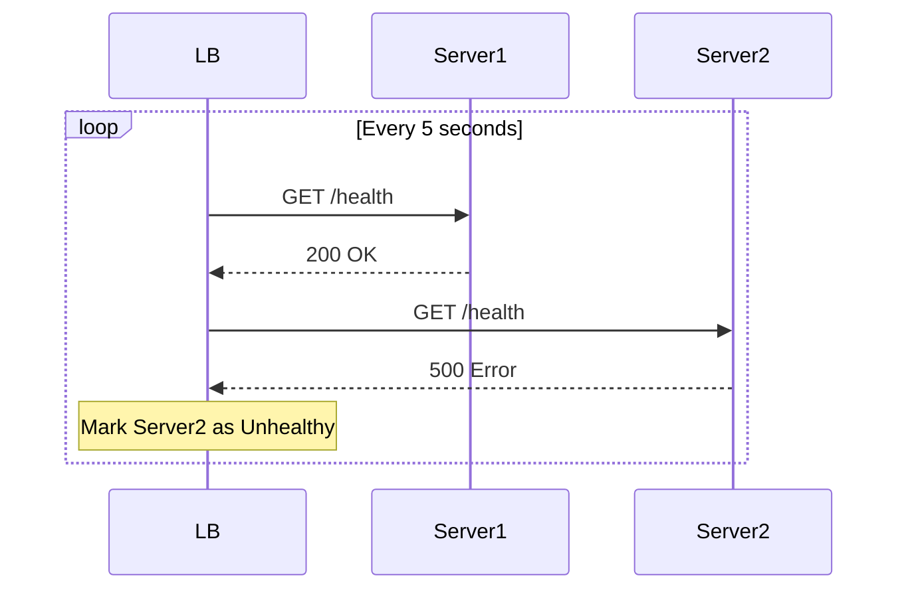

# Load Balancers

A Load Balancer (LB) distributes incoming network traffic across a group of backend servers. It ensures no single server bears too much load.

## Where to place a Load Balancer?

1.  Between User and Web Server.
2.  Between Web Server and Internal Platform Layer (App Server).
3.  Between Internal Platform Layer and Database.



## Algorithms

### 1. Round Robin

Requests are distributed sequentially.

- **Pros:** Simple.
- **Cons:** Doesn't account for server load or capacity.

### 2. Least Connections

Sends requests to the server with the fewest active connections.

- **Pros:** Good for sessions of varying length.

### 3. IP Hash

Uses the client's IP address to determine which server receives the request.

- **Pros:** Ensures a user is always connected to the same server (Sticky Sessions).

## Types of Load Balancers

### Layer 4 (Transport Layer)

- Makes decisions based on IP address and Port (TCP/UDP).
- Faster, less context-aware.
- **Example:** HAProxy (TCP mode), AWS Network Load Balancer (NLB).

### Layer 7 (Application Layer)

- Makes decisions based on content (URL, Cookies, Headers).
- Can route `/video` to video servers and `/chat` to chat servers.
- **Example:** Nginx, AWS Application Load Balancer (ALB).

#### Nginx Configuration Example (L7)

```nginx
http {
    upstream backend_servers {
        server backend1.example.com;
        server backend2.example.com;
        server backend3.example.com;
    }

    server {
        listen 80;
        location / {
            proxy_pass http://backend_servers;
        }

        # Route /api to a specific group
        location /api {
            proxy_pass http://api_servers;
        }
    }
}
```

## Health Checks

LBs regularly check if servers are healthy. If a server fails a health check, the LB stops sending traffic to it until it recovers.

- **Active Health Check:** LB pings the server (e.g., `GET /health`).
- **Passive Health Check:** LB observes real traffic. If 500 errors occur, it marks the server as unhealthy.


