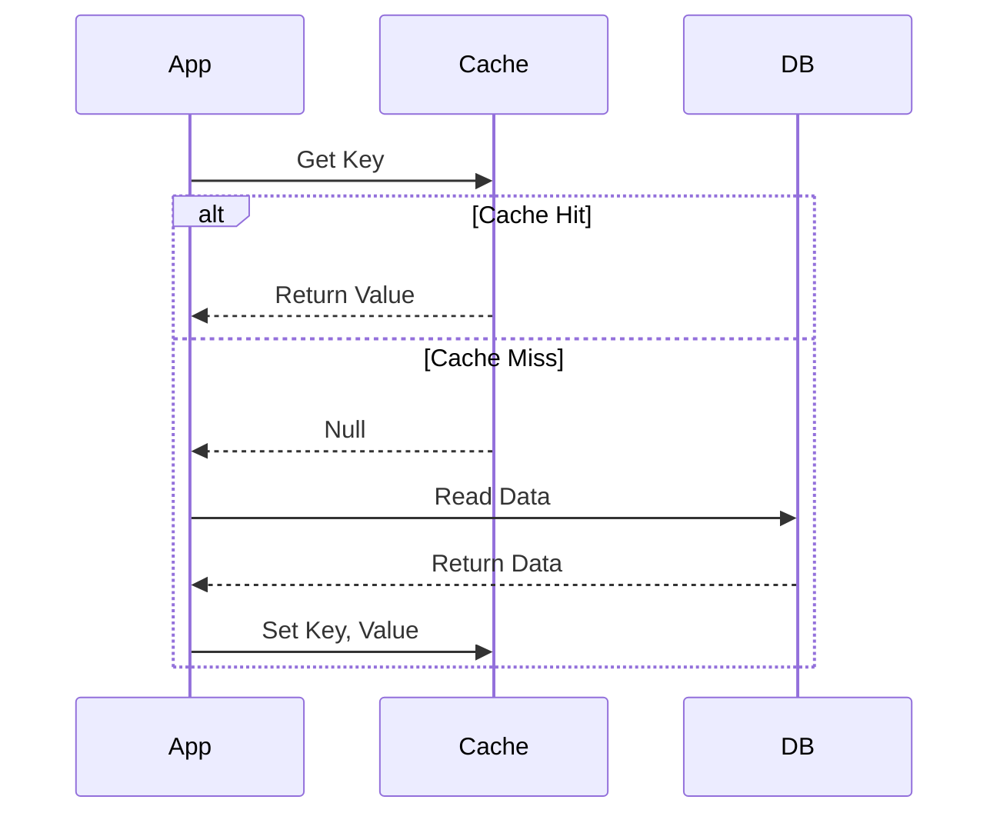

# Caching Strategies

Caching stores copies of data in temporary storage (RAM) for faster access, reducing load on the primary database.

## Caching Layers

1.  **Client Caching:** Browser cache, OS DNS cache.
2.  **CDN (Content Delivery Network):** Caches static assets (images, CSS, JS) closer to the user geographically.
3.  **Load Balancer / API Gateway:** Caches API responses.
4.  **Application Caching:** Redis/Memcached used by the app server.
5.  **Database Caching:** Internal DB buffers.

## Caching Patterns

### 1. Cache-Aside (Lazy Loading)

The application is responsible for reading and writing from the cache.

- **Flow:**
  1.  App checks Cache.
  2.  If **Hit**: Return data.
  3.  If **Miss**: App reads from DB, writes to Cache, returns data.
- **Pros:** Only requested data is cached. Resilient to cache failure.
- **Cons:** Initial request is slow (cache miss). Data can become stale.



#### Code Example: Cache-Aside (Python + Redis)

```python
import redis
import time

r = redis.Redis(host='localhost', port=6379, db=0)

def get_user_profile(user_id):
    # 1. Check Cache
    cached_user = r.get(f"user:{user_id}")
    if cached_user:
        return cached_user # Cache Hit

    # 2. Fetch from DB (Simulated)
    print("Fetching from DB...")
    user_data = db_fetch_user(user_id)

    # 3. Write to Cache with TTL (Time To Live)
    r.setex(f"user:{user_id}", 3600, user_data)

    return user_data
```

### 2. Read-Through

The application treats the cache as the main data store. The cache is responsible for fetching data from the DB if it's missing.

- **Pros:** App logic is simpler.
- **Cons:** Requires a cache provider that supports this (e.g., Redis Gears, specialized libraries).

### 3. Write-Through

Data is written to the cache and the database at the same time.

- **Pros:** Data consistency (Cache is always up-to-date).
- **Cons:** Higher write latency (two writes).

### 4. Write-Back (Write-Behind)

Data is written only to the cache. The cache asynchronously writes to the DB later.

- **Pros:** Very fast writes.
- **Cons:** Risk of data loss if Cache crashes before syncing to DB.

## Common Cache Problems

### 1. Cache Stampede (Thundering Herd)

When a popular cache key expires, thousands of requests hit the DB simultaneously to fetch the same data.

- **Solution:**
  - **Locking:** Only allow one process to fetch from DB.
  - **Probabilistic Early Expiration:** Refresh cache before it actually expires.

### 2. Cache Penetration

Requests for data that **does not exist** in the DB (e.g., `id=-1`). These requests always miss the cache and hit the DB.

- **Solution:**
  - **Bloom Filter:** A probabilistic data structure to check if an element exists.
  - **Cache Nulls:** Store `key: null` with a short TTL.

### 3. Cache Avalanche

Many cache items expire at the same time, causing a spike in DB load.

- **Solution:** Add random jitter to TTL (e.g., `TTL = 3600 + random(0, 300)`).

## Eviction Policies

When the cache is full, what do we remove?

| Policy                          | Description                                                 | Use Case                                        |
| :------------------------------ | :---------------------------------------------------------- | :---------------------------------------------- |
| **LRU (Least Recently Used)**   | Remove the item that hasn't been used for the longest time. | General purpose, social media feeds.            |
| **LFU (Least Frequently Used)** | Remove the item used least often.                           | Analytics, items that are consistently popular. |
| **FIFO (First In, First Out)**  | Remove the oldest item.                                     | Time-series data.                               |
| **TTL (Time To Live)**          | Remove items after a set time period.                       | Session data, volatile prices.                  |
