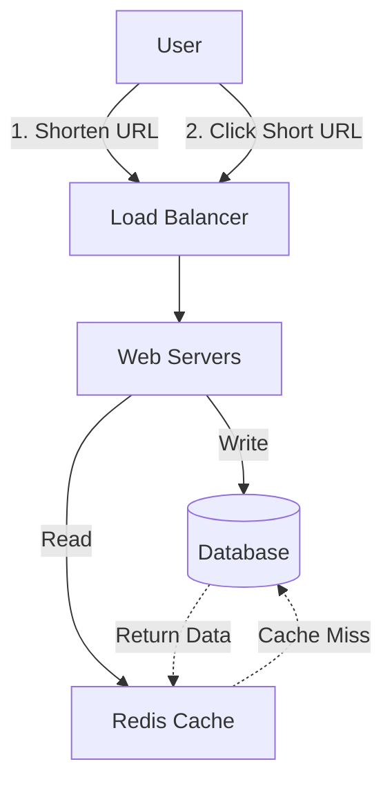

# Design a URL Shortener (TinyURL)

## 1. Requirements

### Functional

- **Shorten URL:** Given a long URL, return a unique short URL (e.g., `http://tiny.url/abc12`).
- **Redirect:** When clicking the short URL, redirect to the original long URL.
- **Custom Alias:** Users can pick a custom alias (optional).
- **Expiration:** URLs expire after a default timespan (optional).

### Non-Functional

- **Highly Available:** If the service is down, URL redirection fails. This is critical.
- **Low Latency:** Redirection should be instant (< 100ms).
- **Read-Heavy:** Many more redirects (reads) than creations (writes). Assume 100:1 ratio.
- **Scalable:** Must handle millions of links.

## 2. Back-of-the-Envelope Estimation

- **Traffic:** 100M new URLs/month.
- **Reads:** 100 \* 100M = 10B redirects/month.
- **QPS (Writes):** 100M / (30 days _ 24 hrs _ 3600 sec) ≈ 40 requests/sec.
- **QPS (Reads):** 40 \* 100 ≈ 4,000 requests/sec.
- **Storage:** 500 bytes per URL. 100M \* 500 bytes = 50GB/month.
  - **5 Years:** 50GB _ 12 _ 5 = 3TB. (Manageable by a single DB, but sharding helps performance).

## 3. High-Level Design



### API Endpoints

1.  `POST /api/v1/shorten`
    - **Input:** `{ "longUrl": "https://www.google.com/..." }`
    - **Output:** `{ "shortUrl": "https://tiny.url/x7z1a" }`
2.  `GET /{shortUrl}`
    - **Output:** HTTP 301 (Permanent) or 302 (Temporary) Redirect to `longUrl`.
    - _Note:_ Use 302 if you want to track analytics (hits) on your server. Use 301 to offload load to the browser cache.

### Database Schema

We need a simple table. NoSQL (DynamoDB/Cassandra) or SQL (MySQL/Postgres) both work. Since we need high availability and easy scaling, NoSQL is a good fit.

**Table:** `UrlMapping`
| Column | Type | Description |
| :--- | :--- | :--- |
| **Hash** (PK) | varchar | The short alias (e.g., "abc12") |
| **OriginalUrl** | varchar | The long URL |
| **CreationDate** | datetime | For expiration logic |
| **UserId** | varchar | (Optional) Who created it |

## 4. Detailed Design: Generating Short Keys

How to generate a unique 7-character string?

### Approach A: Hashing (MD5/SHA256)

Hash the Long URL.

- **Issue:** Hashes are too long (MD5 is 128-bit).
- **Fix:** Take the first 7 characters.
- **Collision:** Different URLs might produce the same first 7 chars.
- **Solution:** If collision, append a salt or sequence number and re-hash. (Expensive).

### Approach B: Base62 Conversion (Recommended)

Use a unique integer ID (Counter) and convert it to Base62 (`[a-z, A-Z, 0-9]`).

- **Base62:** $62^7 \approx 3.5$ Trillion combinations. Enough for years.
- **Flow:**
  1. Generate a unique ID (e.g., Database Auto-Increment or Distributed ID Generator like Snowflake).
  2. Convert ID to Base62.
     - ID `1000` -> `g8`
     - ID `10000000000` -> `aLK9`

#### Code Example: Base62 Encoding (Python)

```python
import string

BASE62 = string.ascii_letters + string.digits # a-z, A-Z, 0-9

def encode(num):
    if num == 0: return BASE62[0]
    arr = []
    base = len(BASE62)
    while num:
        num, rem = divmod(num, base)
        arr.append(BASE62[rem])
    arr.reverse()
    return ''.join(arr)

def decode(string):
    base = len(BASE62)
    strlen = len(string)
    num = 0
    idx = 0
    for char in string:
        power = (strlen - (idx + 1))
        num += BASE62.index(char) * (base ** power)
        idx += 1
    return num

# Test
print(encode(12345)) # 'dnh'
print(decode('dnh')) # 12345
```

### Approach C: Key Generation Service (KGS)

Pre-generate random 7-character strings and store them in a "Unused Keys" table.

- **Pros:** No collisions, fast (just pop a key).
- **Cons:** Need to manage the KGS state.

## 5. Optimization & Scaling

### Caching

Since reads >> writes, caching is vital.

- **Strategy:** Cache-Aside.
- **Key:** Short URL. **Value:** Long URL.
- **Eviction:** LRU (Least Recently Used). 20% of URLs generate 80% of traffic.

### Database Scaling

- **Sharding:** Shard based on the first character of the Hash? Or simply by Hash ID.
- **Replication:** Master-Slave for high read availability.

### Analytics (Optional)

- Decouple analytics from the main redirection path using a Message Queue (Kafka).
- `GET /abc` -> Redirect User -> Push event to Kafka -> Analytics Service processes it.

  - Length 6: $62^6 \approx 56$ billion combinations. Sufficient.
  - Length 7: $62^7 \approx 3.5$ trillion.

### Generating Unique IDs

If multiple users shorten the same URL, or we use a counter, we need unique IDs to Base62 encode.

1.  **UUID:** Too long.
2.  **Database Auto-increment:** Hard to scale across multiple DB instances.
3.  **Distributed ID Generator (Snowflake):** Twitter's approach.
4.  **KGS (Key Generation Service):** Pre-generate random 6-char keys and store them in a DB. Servers fetch unused keys.

## 4. Detailed Design & Scaling

### Caching

Since read traffic is high, cache the `ShortURL -> LongURL` mapping.

- **Eviction Policy:** LRU (Least Recently Used). 20% of URLs generate 80% of traffic.
- **Tech:** Redis / Memcached.

### Load Balancing

Place LBs between Clients and Web Servers, and Web Servers and DB.

### 301 vs 302 Redirect

- **301 (Permanent):** Browser caches the redirect. Reduces server load but you lose analytics (you don't know when they click).
- **302 (Temporary):** Browser always hits your server. Higher load, but better analytics.

## 5. Diagram

Client <--> Load Balancer <--> Web Server <--> Cache (Redis)
|
v
Database
