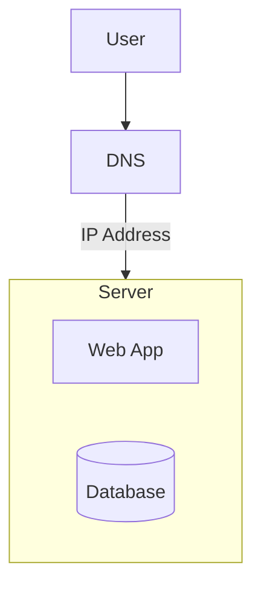
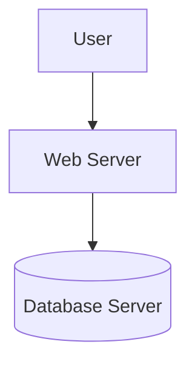
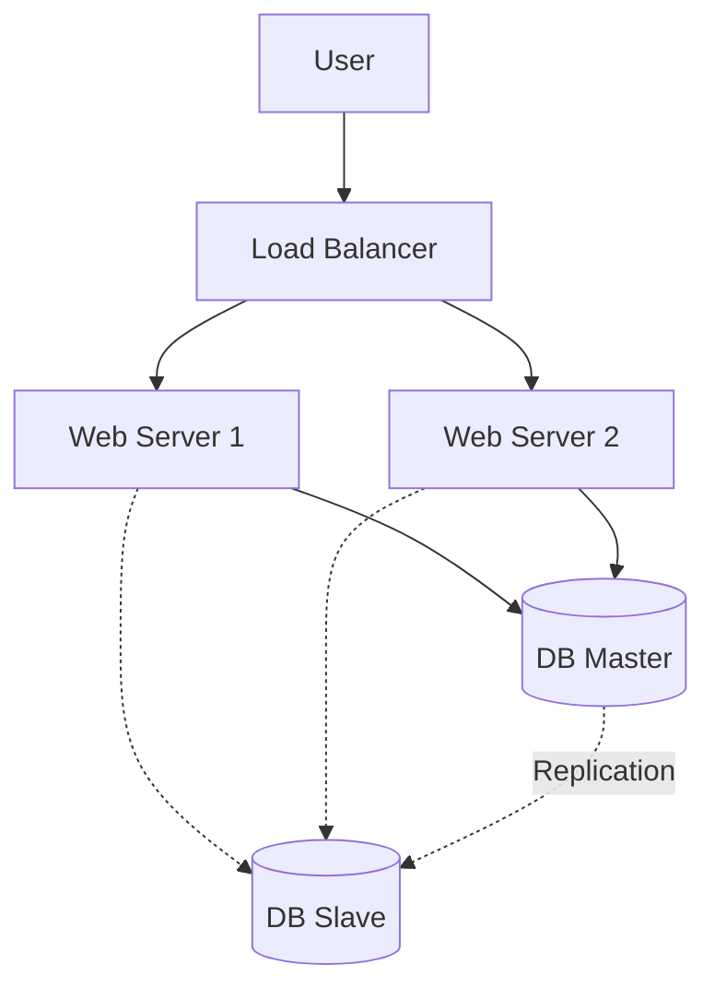
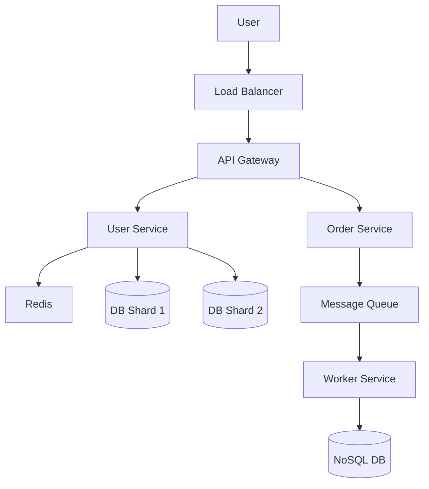

# Scaling from Zero to Millions of Users

This guide walks through the evolution of a system as it grows from a hobby project to a massive scale application.

## Stage 1: The Setup (1 - 10 Users)

**"The All-in-One"**

At this stage, simplicity is key. You don't need distributed systems.

- **Architecture:** Single Server (Monolith).
- **Components:**
  - Web Server (App Logic).
  - Database (SQLite or local MySQL).
  - DNS (Maps domain to IP).
- **Pros:** Cheap, easy to deploy.
- **Cons:** Single point of failure (SPOF). If the server dies, the app dies.



---

## Stage 2: Separation of Concerns (100 - 1,000 Users)

**"Splitting the Database"**

The single server is running out of RAM because the Database and App are fighting for resources.

- **Change:** Move the Database to a separate server.
- **Architecture:**
  - Server A: Web/App Server.
  - Server B: Database Server.
- **Pros:** Independent scaling (can upgrade DB server RAM separately).



---

## Stage 3: Redundancy & Load Balancing (> 10,000 Users)

**"Handling Traffic & Failures"**

One web server isn't enough to handle the traffic, and if it crashes, you are down.

- **Change 1: Load Balancer (LB):** Add a Load Balancer (Nginx/AWS ALB) in front of multiple web servers.
- **Change 2: Database Replication:** Set up Master-Slave replication to handle more reads.
  - **Master:** Writes.
  - **Slave:** Reads.



---

## Stage 4: Speed & Efficiency (> 100,000 Users)

**"Caching & CDN"**

The database is getting hammered with the same queries, and users in other countries complain about slowness.

- **Change 1: Caching (Redis/Memcached):** Cache frequent queries (e.g., User Profiles) to reduce DB load.
- **Change 2: CDN (Content Delivery Network):** Serve static files (Images, CSS, JS) from edge servers closer to the user (e.g., Cloudflare, AWS CloudFront).

```mermaid
graph TD
    User --> CDN[CDN (Images/CSS)]
    User --> LB[Load Balancer]
    LB --> Web[Web Servers]
    Web --> Cache[Redis Cache]
    Web --> DB[(Database)]
```

---

## Stage 5: The Big Scale (> 1,000,000 Users)

**"Sharding & Decoupling"**

The database is too huge for a single server (even with replication), and the application logic is becoming a "Spaghetti Monolith".

- **Change 1: Database Sharding:** Split the database horizontally.
  - Users A-M go to DB Shard 1.
  - Users N-Z go to DB Shard 2.
- **Change 2: Microservices:** Break the Monolith into services (User Service, Order Service, Payment Service).
- **Change 3: Message Queues (Kafka/RabbitMQ):** Decouple services. Instead of processing a video upload immediately, put it in a queue.
- **Change 4: NoSQL:** Move non-relational data (logs, metadata, feed) to NoSQL (Cassandra/DynamoDB) for massive write throughput.



## Summary of Evolution

| Users      | Architecture                   | Bottleneck Solved               |
| :--------- | :----------------------------- | :------------------------------ |
| **1 - 10** | Single Server                  | Getting started.                |
| **1k**     | Separate DB                    | Resource contention (RAM/CPU).  |
| **10k**    | Load Balancer + DB Replication | Availability & Read throughput. |
| **100k**   | Cache + CDN                    | Latency & Database load.        |
| **1M+**    | Sharding + Microservices       | Write throughput & Complexity.  |
