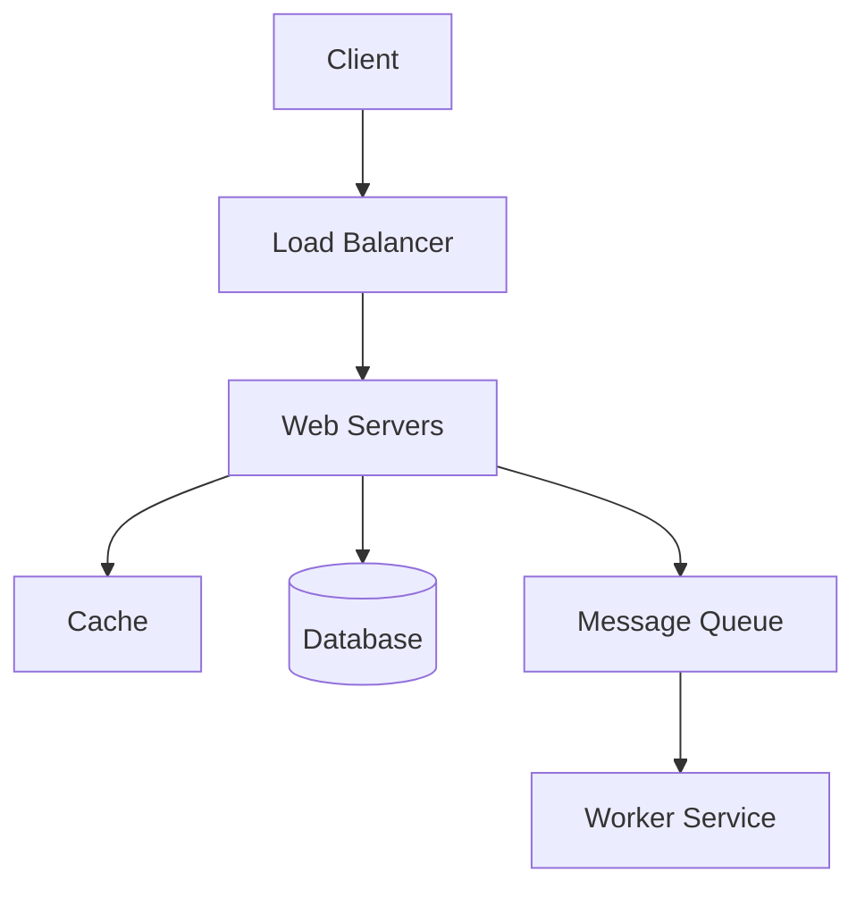

# System Design Interview Framework

A structured approach is crucial for success in system design interviews. Most interviews last 45-60 minutes. Here is a recommended framework (often called **RADIO** or **PEDALS**).

## Step 1: Understand the Goal and Scope (5-10 min)

**Don't jump into design immediately.** Ask questions to clarify requirements.

### Functional Requirements

What should the system do?

- "Users can post tweets."
- "Users can follow others."
- "News feed generation."

### Non-Functional Requirements

- **Scalability:** How many users? (DAU/MAU? 1M or 1B?)
- **Latency:** Is it real-time (Chat) or batch (Email)?
- **Consistency vs. Availability:** CAP Theorem preference? (Banking = CP, Social = AP).
- **Reliability:** Is data loss acceptable?

### Constraints

- **Traffic:** Read/Write ratio (e.g., 100:1 for Twitter).
- **Storage:** How long to keep data? (5 years?).

## Step 2: Back-of-the-Envelope Estimation (5 min)

Do quick math to determine the scale. This influences your design (e.g., Single DB vs Sharding).

- **QPS (Queries Per Second):** `Daily Active Users * Requests per User / 86400`.
- **Storage:** `Daily Writes * Size per Write * 365 days * Years`.
- **Bandwidth:** `QPS * Size per Request`.

_Tip: Use powers of 10. $10^5$ requests/day is tiny. $10^9$ is massive._

## Step 3: High-Level Design & Blueprint (10-15 min)

Draw the main components and how they interact. Keep it simple initially.

- **Clients:** Mobile, Web.
- **Load Balancer:** Entry point.
- **Web/App Servers:** Handling logic (Stateless).
- **Database:** Where is data stored?
- **Storage:** Blob storage for images/videos (S3).

**Deliverable:** A block diagram showing the flow of data.

## Step 4: Deep Dive (15-25 min)

Pick the most interesting or complex components and drill down. This often depends on the interviewer's feedback.

- **Data Model:** Schema design (SQL vs NoSQL).
- **Scaling:** Sharding, Replication, Stateless vs Stateful.
- **Reliability:** Circuit Breakers, Retries, Idempotency.
- **Performance:** Caching (Stampede/Penetration), Rate Limiting.
- **Observability:** How will you debug it? (Metrics, Logs, Tracing).
- **Security:** AuthN/AuthZ (JWT vs Session).

## Step 5: Wrap Up (5 min)

Review your design and discuss trade-offs.

- **Summary:** Recap the flow.
- **Bottlenecks:** Admit where the system might struggle (e.g., "Resharding is hard").
- **Improvements:** What would you change if you had more time? (e.g., "Add monitoring", "Better analytics").

---

## Cheat Sheet: The "Magic" Components

If you get stuck, consider if adding one of these solves the problem:

1.  **Read Heavy?** -> Add **Cache** (Redis) or **Read Replicas**.
2.  **Write Heavy?** -> Use **Message Queue** (Kafka) for buffering or **Sharding**.
3.  **Slow Database?** -> Add **Index** or **Denormalize** data.
4.  **Single Point of Failure?** -> Add **Replication** / **Load Balancer**.
5.  **Global Latency?** -> Use **CDN** (Content Delivery Network).
6.  **Complex Search?** -> Use **Elasticsearch**.
7.  **Unstructured Data?** -> Use **NoSQL** (MongoDB/S3).
8.  **Abuse/Spam?** -> Add **Rate Limiter**.
9.  **Flaky Service?** -> Add **Circuit Breaker** / **Retries**.
